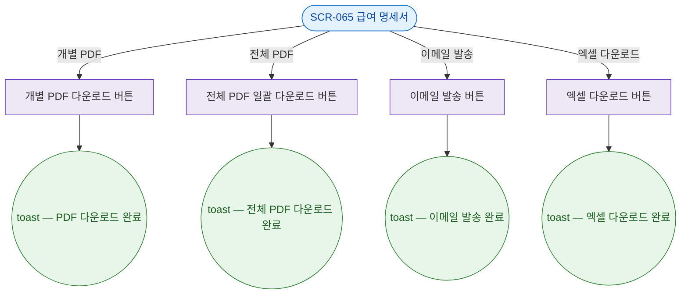

## 3. 다이어그램

```mermaid
flowchart TD
  SCR_065([SCR-065 급여 명세서])

  SCR_065 -->|개별 PDF|BTN_PDF_SINGLE[개별 PDF 다운로드 버튼]
  SCR_065 -->|전체 PDF|BTN_PDF_ALL[전체 PDF 일괄 다운로드 버튼]
  SCR_065 -->|이메일 발송|BTN_EMAIL[이메일 발송 버튼]
  SCR_065 -->|엑셀 다운로드|BTN_EXCEL[엑셀 다운로드 버튼]

  BTN_PDF_SINGLE --> TOAST_PDF_OK((toast — PDF 다운로드 완료))
  BTN_PDF_ALL --> TOAST_PDF_ALL_OK((toast — 전체 PDF 다운로드 완료))
  BTN_EMAIL --> TOAST_EMAIL_OK((toast — 이메일 발송 완료))
  BTN_EXCEL --> TOAST_EXCEL_OK((toast — 엑셀 다운로드 완료))

  classDef screen fill:#E3F2FD,stroke:#1976D2,color:#0D47A1
  classDef success fill:#E8F5E9,stroke:#2E7D32,color:#1B5E20
  classDef system fill:#EDE7F6,stroke:#5E35B2

  class SCR_065 screen
  class TOAST_PDF_OK,TOAST_PDF_ALL_OK,TOAST_EMAIL_OK,TOAST_EXCEL_OK success
  class BTN_PDF_SINGLE,BTN_PDF_ALL,BTN_EMAIL,BTN_EXCEL system
```
