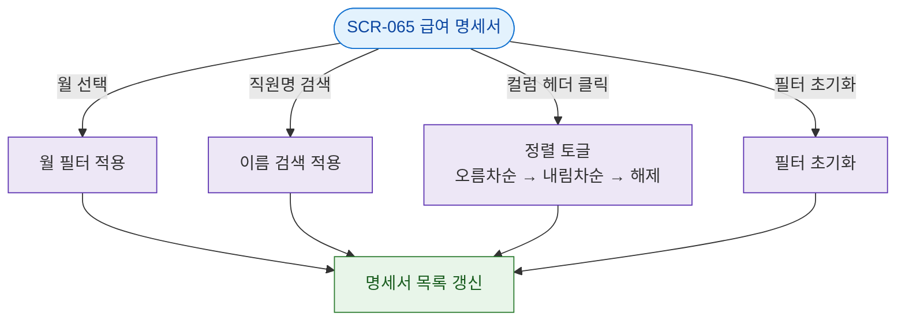

## 3. 다이어그램

```mermaid
flowchart TD
  SCR_065([SCR-065 급여 명세서])

  SCR_065 -->|월 선택|FILTER_MONTH[월 필터 적용]
  SCR_065 -->|직원명 검색|FILTER_SEARCH[이름 검색 적용]
  SCR_065 -->|컬럼 헤더 클릭|SORT[정렬 토글\n오름차순 → 내림차순 → 해제]
  SCR_065 -->|필터 초기화|RESET[필터 초기화]

  FILTER_MONTH --> RESULT[명세서 목록 갱신]
  FILTER_SEARCH --> RESULT
  SORT --> RESULT
  RESET --> RESULT

  classDef screen fill:#E3F2FD,stroke:#1976D2,color:#0D47A1
  classDef system fill:#EDE7F6,stroke:#5E35B2
  classDef success fill:#E8F5E9,stroke:#2E7D32,color:#1B5E20

  class SCR_065 screen
  class FILTER_MONTH,FILTER_SEARCH,SORT,RESET system
  class RESULT success
```
