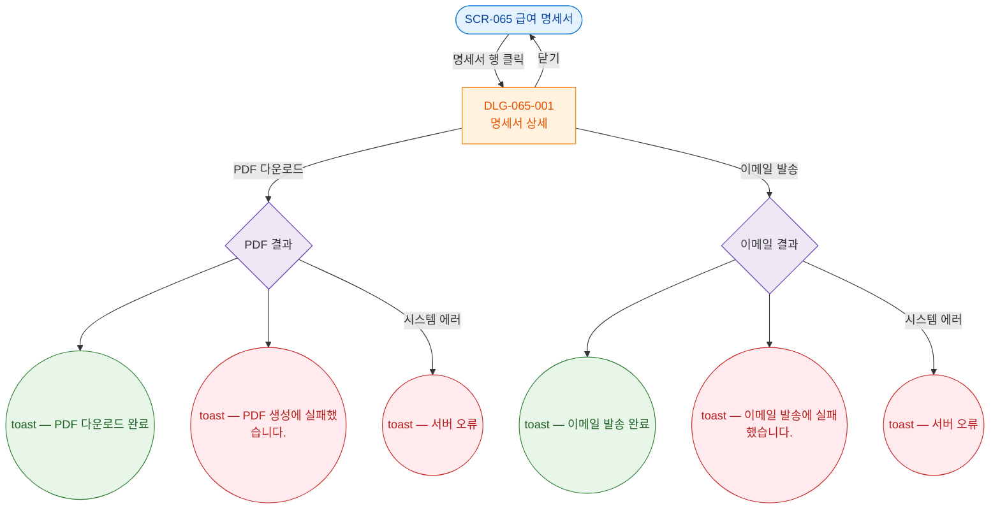

## 3. 다이어그램

```mermaid
flowchart TD
  SCR_065([SCR-065 급여 명세서])

  SCR_065 -->|명세서 행 클릭|DLG_065_001[DLG-065-001\n명세서 상세]

  DLG_065_001 -->|닫기|SCR_065
  DLG_065_001 -->|PDF 다운로드|PDF_RESULT{PDF 결과}
  PDF_RESULT --> TOAST_PDF_OK((toast — PDF 다운로드 완료))
  PDF_RESULT --> TOAST_PDF_ERR((toast — PDF 생성에 실패했습니다.))
  PDF_RESULT -->|시스템 에러|TOAST_PDF_SYS((toast — 서버 오류))

  DLG_065_001 -->|이메일 발송|EMAIL_RESULT{이메일 결과}
  EMAIL_RESULT --> TOAST_EMAIL_OK((toast — 이메일 발송 완료))
  EMAIL_RESULT --> TOAST_EMAIL_ERR((toast — 이메일 발송에 실패했습니다.))
  EMAIL_RESULT -->|시스템 에러|TOAST_EMAIL_SYS((toast — 서버 오류))

  classDef screen fill:#E3F2FD,stroke:#1976D2,color:#0D47A1
  classDef modal fill:#FFF3E0,stroke:#F57C00,color:#E65100
  classDef success fill:#E8F5E9,stroke:#2E7D32,color:#1B5E20
  classDef error fill:#FFEBEE,stroke:#C62828,color:#B71C1C
  classDef system fill:#EDE7F6,stroke:#5E35B2

  class SCR_065 screen
  class DLG_065_001 modal
  class TOAST_PDF_OK,TOAST_EMAIL_OK success
  class TOAST_PDF_ERR,TOAST_PDF_SYS,TOAST_EMAIL_ERR,TOAST_EMAIL_SYS error
  class PDF_RESULT,EMAIL_RESULT system
```
