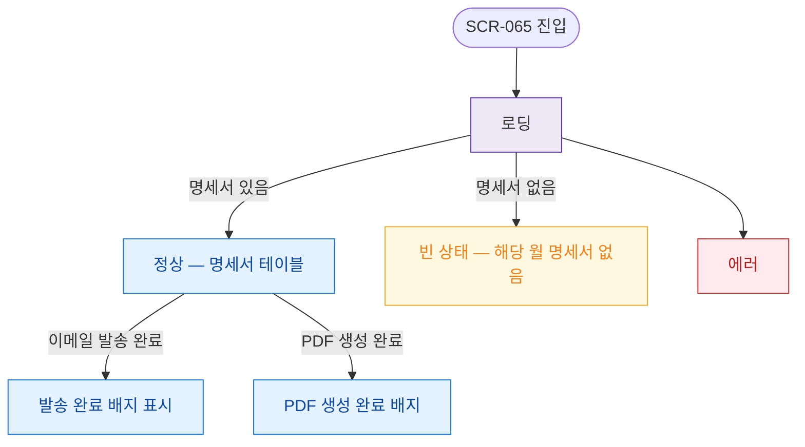

## 3. 다이어그램

```mermaid
flowchart TD
  ENTER([SCR-065 진입])
  ENTER --> STATE_LOADING[로딩]
  STATE_LOADING -->|명세서 있음|STATE_NORMAL[정상 — 명세서 테이블]
  STATE_LOADING -->|명세서 없음|STATE_EMPTY[빈 상태 — 해당 월 명세서 없음]
  STATE_LOADING --> STATE_ERR[에러]

  STATE_NORMAL -->|이메일 발송 완료|STATE_SENT[발송 완료 배지 표시]
  STATE_NORMAL -->|PDF 생성 완료|STATE_PDF[PDF 생성 완료 배지]

  classDef screen fill:#E3F2FD,stroke:#1976D2,color:#0D47A1
  classDef system fill:#EDE7F6,stroke:#5E35B2
  classDef error fill:#FFEBEE,stroke:#C62828,color:#B71C1C
  classDef warning fill:#FFF8E1,stroke:#F9A825,color:#F57F17
  classDef success fill:#E8F5E9,stroke:#2E7D32,color:#1B5E20

  class STATE_NORMAL,STATE_SENT,STATE_PDF screen
  class STATE_LOADING system
  class STATE_ERR error
  class STATE_EMPTY warning
```
