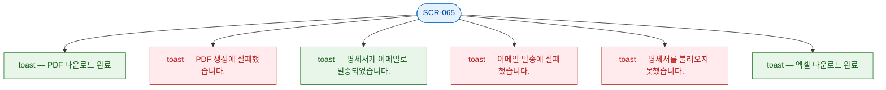

## 3. 다이어그램

## 4. 토스트 목록

| 트리거 | 유형 | 메시지 |
|--------|------|--------|
| PDF 다운로드 성공 | success | PDF 다운로드 완료 |
| PDF 생성 실패 | error | PDF 생성에 실패했습니다. |
| 이메일 발송 성공 | success | 명세서가 이메일로 발송되었습니다. |
| 이메일 발송 실패 | error | 이메일 발송에 실패했습니다. |
| 데이터 로드 실패 | error | 명세서를 불러오지 못했습니다. |
| 엑셀 다운로드 | success | 엑셀 다운로드 완료 |
