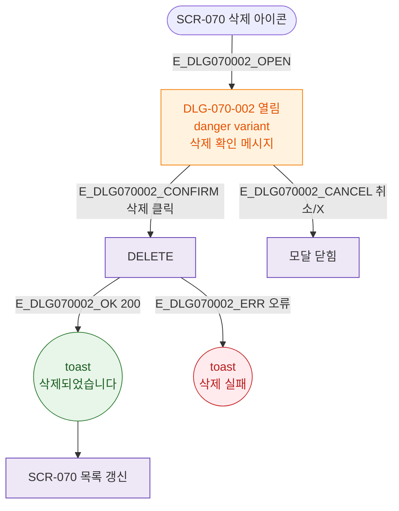

## 3. 다이어그램

```mermaid
flowchart TD
  TRIGGER([SCR-070 삭제 아이콘]) -->|E_DLG070002_OPEN|MODAL[DLG-070-002 열림\ndanger variant\n삭제 확인 메시지]
  MODAL -->|E_DLG070002_CONFIRM 삭제 클릭|API[DELETE]
  MODAL -->|E_DLG070002_CANCEL 취소/X|CLOSE[모달 닫힘]
  API -->|E_DLG070002_OK 200|T_OK((toast\n삭제되었습니다))
  API -->|E_DLG070002_ERR 오류|T_ERR((toast\n삭제 실패))
  T_OK --> REFRESH[SCR-070 목록 갱신]

  classDef modal fill:#FFF3E0,stroke:#F57C00,color:#E65100
  classDef error fill:#FFEBEE,stroke:#C62828,color:#B71C1C
  classDef success fill:#E8F5E9,stroke:#2E7D32,color:#1B5E20
  classDef system fill:#EDE7F6,stroke:#5E35B2

  class MODAL modal
  class T_OK success
  class T_ERR error
  class API,CLOSE,REFRESH system
```
