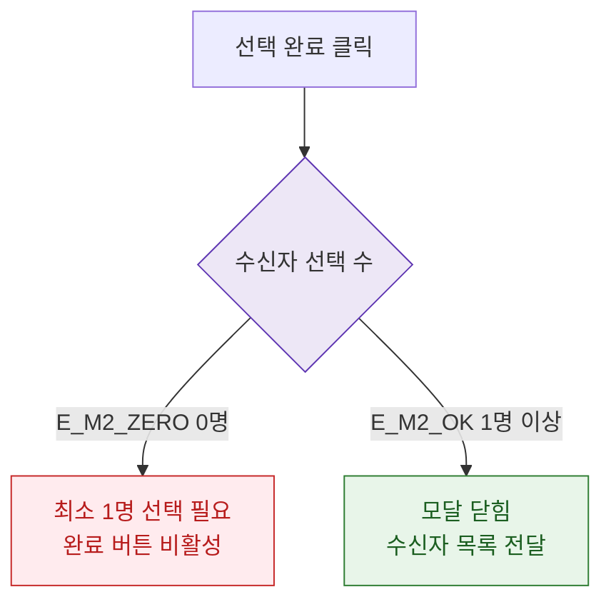

## 3. 다이어그램

```mermaid
flowchart TD
  DONE[선택 완료 클릭] --> CHECK{수신자 선택 수}
  CHECK -->|E_M2_ZERO 0명|ERR_ZERO[최소 1명 선택 필요\n완료 버튼 비활성]
  CHECK -->|E_M2_OK 1명 이상|CLOSE[모달 닫힘\n수신자 목록 전달]

  classDef error fill:#FFEBEE,stroke:#C62828,color:#B71C1C
  classDef success fill:#E8F5E9,stroke:#2E7D32,color:#1B5E20
  classDef system fill:#EDE7F6,stroke:#5E35B2

  class ERR_ZERO error
  class CLOSE success
  class CHECK system
```
