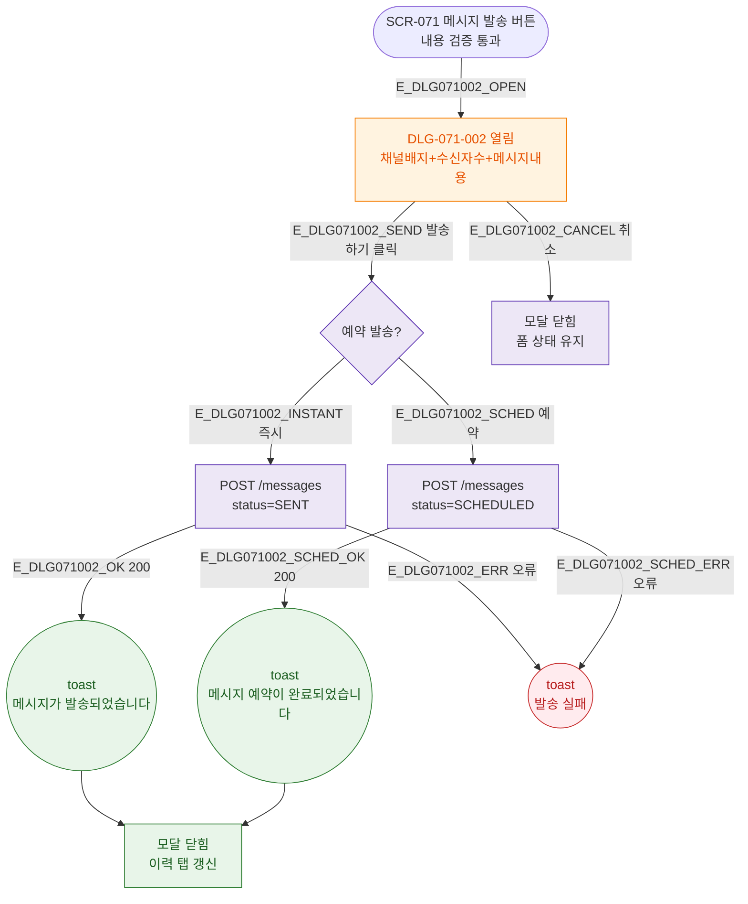

## 3. 다이어그램

```mermaid
flowchart TD
  TRIGGER([SCR-071 메시지 발송 버튼\n내용 검증 통과]) -->|E_DLG071002_OPEN|MODAL[DLG-071-002 열림\n채널배지+수신자수+메시지내용]
  MODAL -->|E_DLG071002_SEND 발송하기 클릭|RESERVE{예약 발송?}
  MODAL -->|E_DLG071002_CANCEL 취소|CLOSE[모달 닫힘\n폼 상태 유지]

  RESERVE -->|E_DLG071002_INSTANT 즉시|API_INSTANT[POST /messages\nstatus=SENT]
  RESERVE -->|E_DLG071002_SCHED 예약|API_SCHED[POST /messages\nstatus=SCHEDULED]

  API_INSTANT -->|E_DLG071002_OK 200|T_OK((toast\n메시지가 발송되었습니다))
  API_SCHED -->|E_DLG071002_SCHED_OK 200|T_SCHED((toast\n메시지 예약이 완료되었습니다))
  API_INSTANT -->|E_DLG071002_ERR 오류|T_ERR((toast\n발송 실패))
  API_SCHED -->|E_DLG071002_SCHED_ERR 오류|T_ERR

  T_OK --> CLOSE_OK[모달 닫힘\n이력 탭 갱신]
  T_SCHED --> CLOSE_OK

  classDef modal fill:#FFF3E0,stroke:#F57C00,color:#E65100
  classDef success fill:#E8F5E9,stroke:#2E7D32,color:#1B5E20
  classDef error fill:#FFEBEE,stroke:#C62828,color:#B71C1C
  classDef system fill:#EDE7F6,stroke:#5E35B2

  class MODAL modal
  class T_OK,T_SCHED,CLOSE_OK success
  class T_ERR error
  class RESERVE,API_INSTANT,API_SCHED,CLOSE system
```
