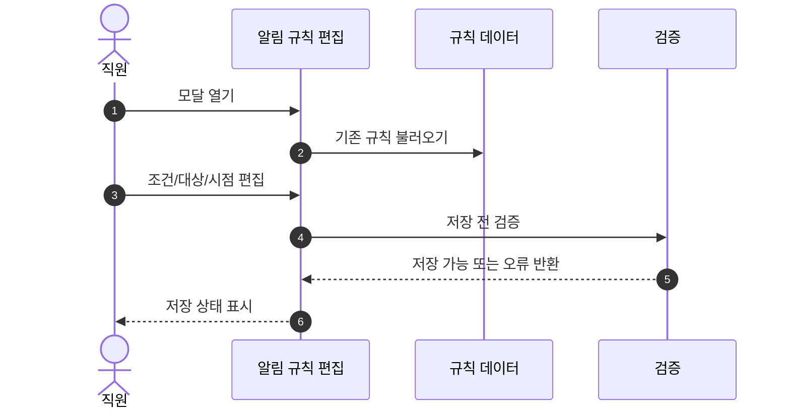

# DLG-072-001 알림 규칙 편집 생명주기

```mermaid
sequenceDiagram
    autonumber
    actor Staff as 직원
    participant Modal as 알림 규칙 편집
    participant Rule as 규칙 데이터
    participant Validator as 검증

    Staff->>Modal: 모달 열기
    Modal->>Rule: 기존 규칙 불러오기
    Staff->>Modal: 조건/대상/시점 편집
    Modal->>Validator: 저장 전 검증
    Validator-->>Modal: 저장 가능 또는 오류 반환
    Modal-->>Staff: 저장 상태 표시
```
