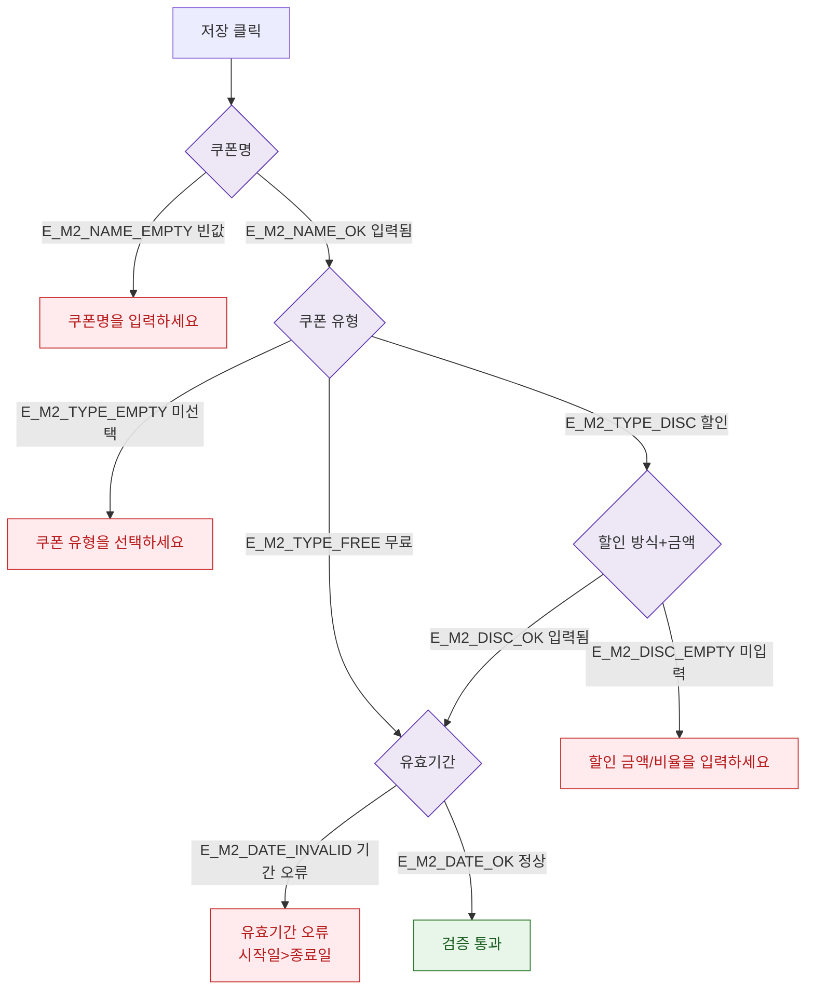

## 3. 다이어그램

```mermaid
flowchart TD
  SAVE[저장 클릭] --> F_NAME{쿠폰명}
  F_NAME -->|E_M2_NAME_EMPTY 빈값|ERR_NAME[쿠폰명을 입력하세요]
  F_NAME -->|E_M2_NAME_OK 입력됨|F_TYPE{쿠폰 유형}
  F_TYPE -->|E_M2_TYPE_EMPTY 미선택|ERR_TYPE[쿠폰 유형을 선택하세요]
  F_TYPE -->|E_M2_TYPE_DISC 할인|F_DISC{할인 방식+금액}
  F_TYPE -->|E_M2_TYPE_FREE 무료|F_DATE{유효기간}

  F_DISC -->|E_M2_DISC_EMPTY 미입력|ERR_DISC[할인 금액/비율을 입력하세요]
  F_DISC -->|E_M2_DISC_OK 입력됨|F_DATE
  F_DATE -->|E_M2_DATE_INVALID 기간 오류|ERR_DATE[유효기간 오류\n시작일>종료일]
  F_DATE -->|E_M2_DATE_OK 정상|ALL_OK[검증 통과]

  classDef error fill:#FFEBEE,stroke:#C62828,color:#B71C1C
  classDef success fill:#E8F5E9,stroke:#2E7D32,color:#1B5E20
  classDef system fill:#EDE7F6,stroke:#5E35B2

  class ERR_NAME,ERR_TYPE,ERR_DISC,ERR_DATE error
  class ALL_OK success
  class F_NAME,F_TYPE,F_DISC,F_DATE system
```
