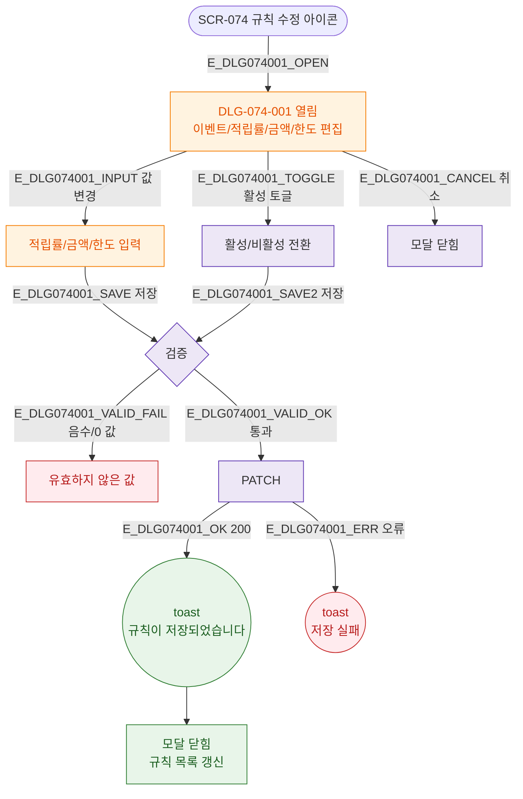

## 3. 다이어그램

```mermaid
flowchart TD
  TRIGGER([SCR-074 규칙 수정 아이콘]) -->|E_DLG074001_OPEN|MODAL[DLG-074-001 열림\n이벤트/적립률/금액/한도 편집]
  MODAL -->|E_DLG074001_INPUT 값 변경|INPUT[적립률/금액/한도 입력]
  MODAL -->|E_DLG074001_TOGGLE 활성 토글|TOGGLE[활성/비활성 전환]
  INPUT -->|E_DLG074001_SAVE 저장|VALID{검증}
  TOGGLE -->|E_DLG074001_SAVE2 저장|VALID
  MODAL -->|E_DLG074001_CANCEL 취소|CLOSE[모달 닫힘]

  VALID -->|E_DLG074001_VALID_FAIL 음수/0 값|ERR[유효하지 않은 값]
  VALID -->|E_DLG074001_VALID_OK 통과|API[PATCH]
  API -->|E_DLG074001_OK 200|T_OK((toast\n규칙이 저장되었습니다))
  API -->|E_DLG074001_ERR 오류|T_ERR((toast\n저장 실패))
  T_OK --> CLOSE_OK[모달 닫힘\n규칙 목록 갱신]

  classDef modal fill:#FFF3E0,stroke:#F57C00,color:#E65100
  classDef success fill:#E8F5E9,stroke:#2E7D32,color:#1B5E20
  classDef error fill:#FFEBEE,stroke:#C62828,color:#B71C1C
  classDef system fill:#EDE7F6,stroke:#5E35B2

  class MODAL,INPUT modal
  class T_OK,CLOSE_OK success
  class ERR,T_ERR error
  class VALID,API,TOGGLE,CLOSE system
```
