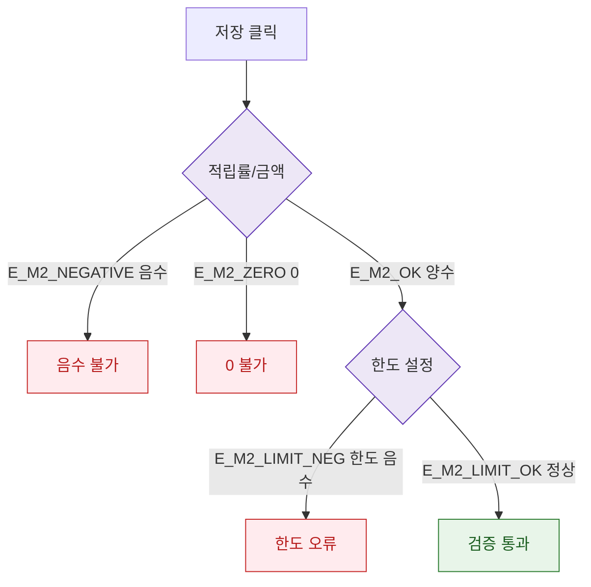

## 3. 다이어그램

```mermaid
flowchart TD
  SAVE[저장 클릭] --> F_RATE{적립률/금액}
  F_RATE -->|E_M2_NEGATIVE 음수|ERR_NEG[음수 불가]
  F_RATE -->|E_M2_ZERO 0|ERR_ZERO[0 불가]
  F_RATE -->|E_M2_OK 양수|F_LIMIT{한도 설정}
  F_LIMIT -->|E_M2_LIMIT_NEG 한도 음수|ERR_LIMIT[한도 오류]
  F_LIMIT -->|E_M2_LIMIT_OK 정상|ALL_OK[검증 통과]

  classDef error fill:#FFEBEE,stroke:#C62828,color:#B71C1C
  classDef success fill:#E8F5E9,stroke:#2E7D32,color:#1B5E20
  classDef system fill:#EDE7F6,stroke:#5E35B2

  class ERR_NEG,ERR_ZERO,ERR_LIMIT error
  class ALL_OK success
  class F_RATE,F_LIMIT system
```
