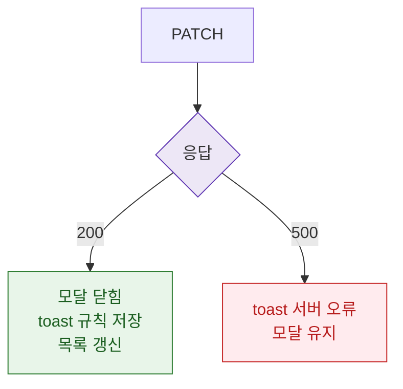

## 3. 다이어그램

```mermaid
flowchart TD
  API[PATCH] --> RESP{응답}
  RESP -->|200|OK[모달 닫힘\ntoast 규칙 저장\n목록 갱신]
  RESP -->|500|ERR[toast 서버 오류\n모달 유지]

  classDef success fill:#E8F5E9,stroke:#2E7D32,color:#1B5E20
  classDef error fill:#FFEBEE,stroke:#C62828,color:#B71C1C
  classDef system fill:#EDE7F6,stroke:#5E35B2

  class OK success
  class ERR error
  class RESP system
```
