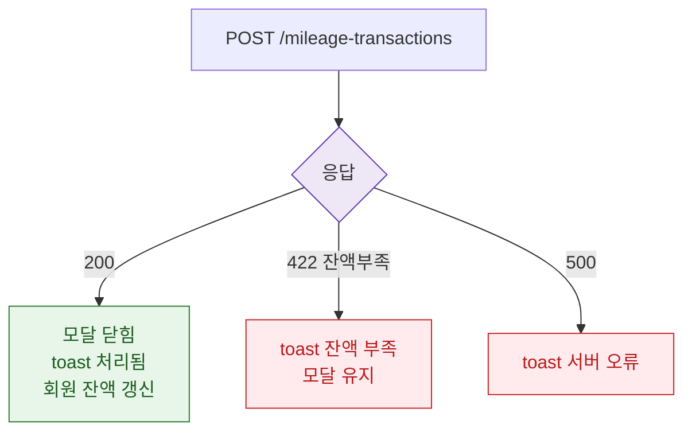

## 3. 다이어그램

```mermaid
flowchart TD
  API[POST /mileage-transactions] --> RESP{응답}
  RESP -->|200|OK[모달 닫힘\ntoast 처리됨\n회원 잔액 갱신]
  RESP -->|422 잔액부족|ERR_BAL[toast 잔액 부족\n모달 유지]
  RESP -->|500|ERR_SRV[toast 서버 오류]

  classDef success fill:#E8F5E9,stroke:#2E7D32,color:#1B5E20
  classDef error fill:#FFEBEE,stroke:#C62828,color:#B71C1C
  classDef system fill:#EDE7F6,stroke:#5E35B2

  class OK success
  class ERR_BAL,ERR_SRV error
  class RESP system
```
