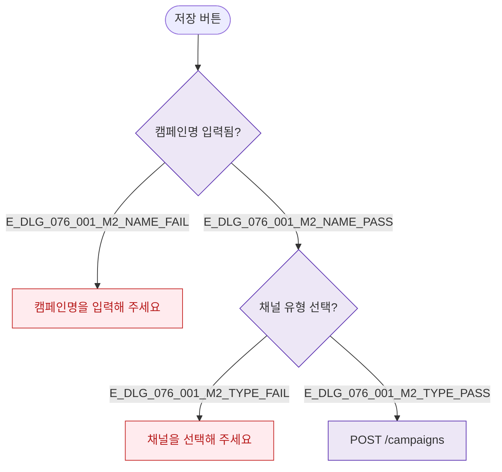

## 3. 다이어그램

```mermaid
flowchart TD
  SUBMIT([저장 버튼]) --> V_NAME{캠페인명 입력됨?}
  V_NAME -->|E_DLG_076_001_M2_NAME_FAIL|ERR_NAME[캠페인명을 입력해 주세요]
  V_NAME -->|E_DLG_076_001_M2_NAME_PASS|V_TYPE{채널 유형 선택?}
  V_TYPE -->|E_DLG_076_001_M2_TYPE_FAIL|ERR_TYPE[채널을 선택해 주세요]
  V_TYPE -->|E_DLG_076_001_M2_TYPE_PASS|API[POST /campaigns]

  classDef error fill:#FFEBEE,stroke:#C62828,color:#B71C1C
  classDef system fill:#EDE7F6,stroke:#5E35B2

  class ERR_NAME,ERR_TYPE error
  class V_NAME,V_TYPE,API system
```
