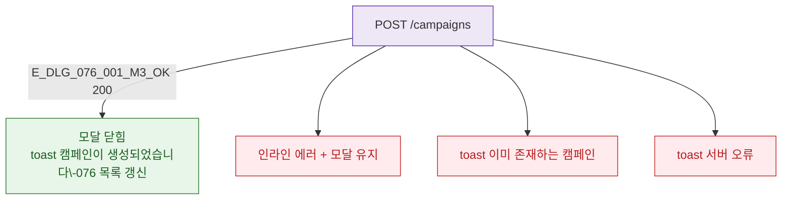

## 3. 다이어그램

```mermaid
flowchart TD
  API[POST /campaigns] -->|E_DLG_076_001_M3_OK 200|SUCCESS[모달 닫힘\ntoast 캠페인이 생성되었습니다\-076 목록 갱신]
  API --> ERR_400[인라인 에러 + 모달 유지]
  API --> ERR_409[toast 이미 존재하는 캠페인]
  API --> ERR_500[toast 서버 오류]

  classDef success fill:#E8F5E9,stroke:#2E7D32,color:#1B5E20
  classDef error fill:#FFEBEE,stroke:#C62828,color:#B71C1C
  classDef system fill:#EDE7F6,stroke:#5E35B2

  class SUCCESS success
  class ERR_400,ERR_409,ERR_500 error
  class API system
```
