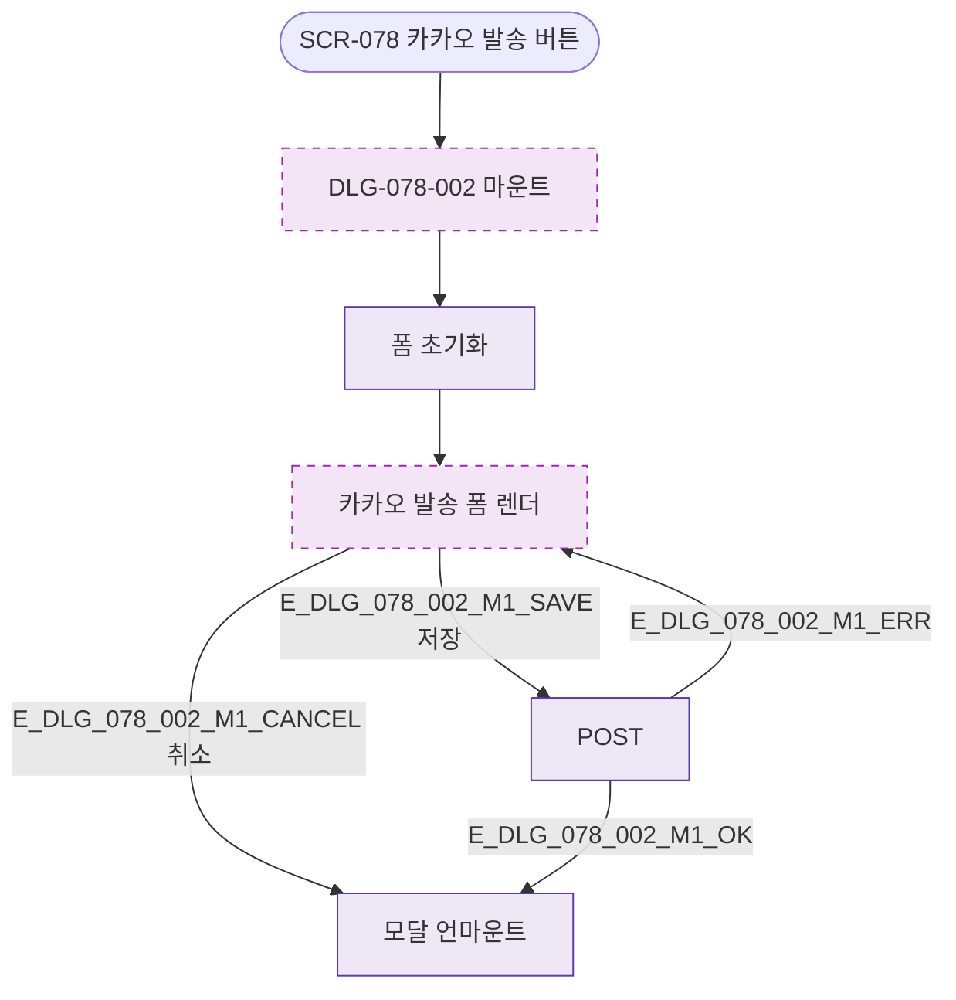

## 3. 다이어그램

```mermaid
flowchart TD
  TRIGGER([SCR-078 카카오 발송 버튼]) --> OPEN[DLG-078-002 마운트]
  OPEN --> INIT[폼 초기화]
  INIT --> RENDER[카카오 발송 폼 렌더]
  RENDER -->|E_DLG_078_002_M1_SAVE 저장|SUBMIT[POST]
  RENDER -->|E_DLG_078_002_M1_CANCEL 취소|UNMOUNT[모달 언마운트]
  SUBMIT -->|E_DLG_078_002_M1_OK|UNMOUNT
  SUBMIT -->|E_DLG_078_002_M1_ERR|RENDER

  classDef newFeature fill:#F3E5F5,stroke:#9C27B0,stroke-dasharray:5 5
  classDef system fill:#EDE7F6,stroke:#5E35B2

  class OPEN,RENDER newFeature
  class INIT,SUBMIT,UNMOUNT system
```
