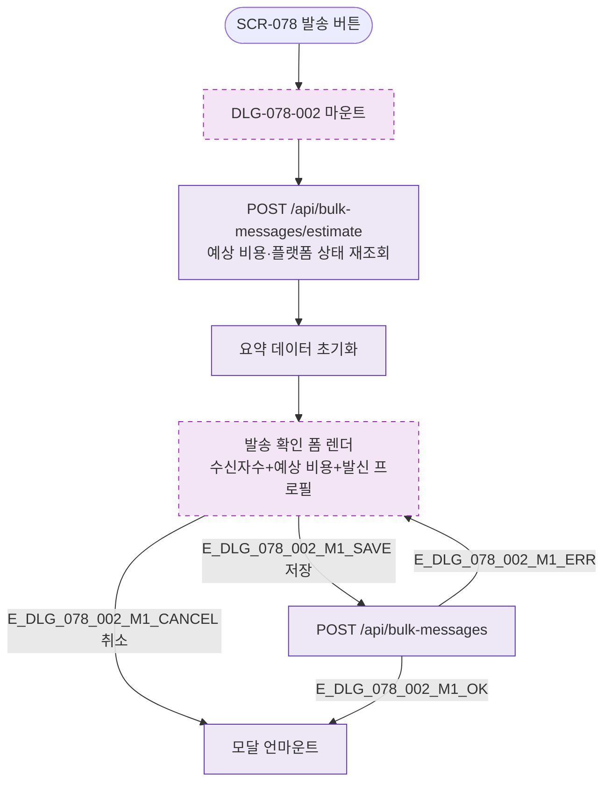

## 3. 다이어그램

```mermaid
flowchart TD
  TRIGGER([SCR-078 발송 버튼]) --> OPEN[DLG-078-002 마운트]
  OPEN --> FETCH[POST /api/bulk-messages/estimate\n예상 비용·플랫폼 상태 재조회]
  FETCH --> INIT[요약 데이터 초기화]
  INIT --> RENDER[발송 확인 폼 렌더\n수신자수+예상 비용+발신 프로필]
  RENDER -->|E_DLG_078_002_M1_SAVE 저장|SUBMIT[POST /api/bulk-messages]
  RENDER -->|E_DLG_078_002_M1_CANCEL 취소|UNMOUNT[모달 언마운트]
  SUBMIT -->|E_DLG_078_002_M1_OK|UNMOUNT
  SUBMIT -->|E_DLG_078_002_M1_ERR|RENDER

  classDef newFeature fill:#F3E5F5,stroke:#9C27B0,stroke-dasharray:5 5
  classDef system fill:#EDE7F6,stroke:#5E35B2

  class OPEN,RENDER newFeature
  class FETCH,INIT,SUBMIT,UNMOUNT system
```
