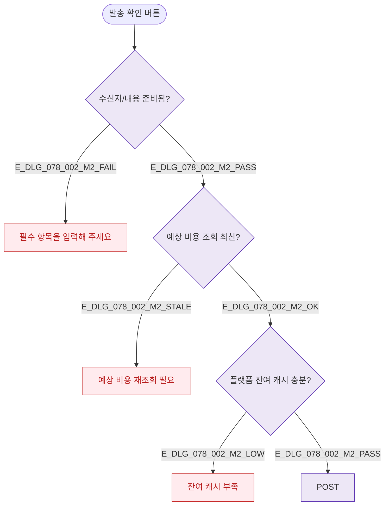

## 3. 다이어그램

```mermaid
flowchart TD
  SUBMIT([발송 확인 버튼]) --> V_REQ{수신자/내용 준비됨?}
  V_REQ -->|E_DLG_078_002_M2_FAIL|ERR[필수 항목을 입력해 주세요]
  V_REQ -->|E_DLG_078_002_M2_PASS|V_SYNC{예상 비용 조회 최신?}
  V_SYNC -->|E_DLG_078_002_M2_STALE|ERR_SYNC[예상 비용 재조회 필요]
  V_SYNC -->|E_DLG_078_002_M2_OK|V_BAL{플랫폼 잔여 캐시 충분?}
  V_BAL -->|E_DLG_078_002_M2_LOW|ERR_BAL[잔여 캐시 부족]
  V_BAL -->|E_DLG_078_002_M2_PASS|API[POST]

  classDef error fill:#FFEBEE,stroke:#C62828,color:#B71C1C
  classDef system fill:#EDE7F6,stroke:#5E35B2

  class ERR,ERR_SYNC,ERR_BAL error
  class V_REQ,V_SYNC,V_BAL,API system
```
