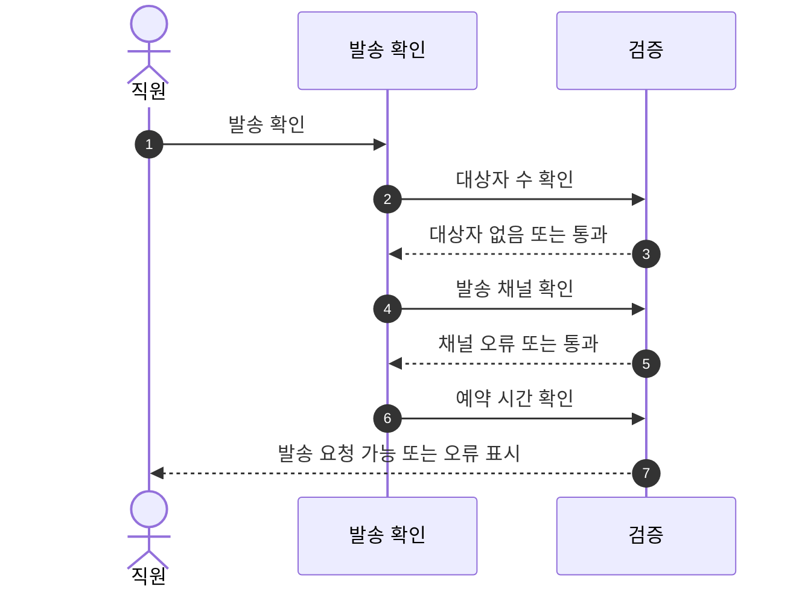

# DLG-078-002 발송 확인 필드 검증

```mermaid
sequenceDiagram
    autonumber
    actor Staff as 직원
    participant Modal as 발송 확인
    participant Validator as 검증

    Staff->>Modal: 발송 확인
    Modal->>Validator: 대상자 수 확인
    Validator-->>Modal: 대상자 없음 또는 통과
    Modal->>Validator: 발송 채널 확인
    Validator-->>Modal: 채널 오류 또는 통과
    Modal->>Validator: 예약 시간 확인
    Validator-->>Staff: 발송 요청 가능 또는 오류 표시
```
