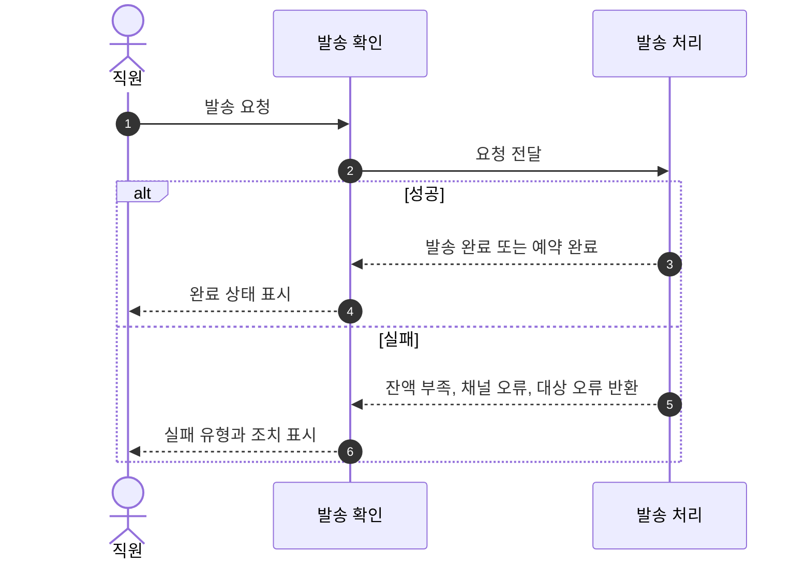

# DLG-078-002 발송 확인 결과 분기

```mermaid
sequenceDiagram
    autonumber
    actor Staff as 직원
    participant Modal as 발송 확인
    participant Sender as 발송 처리

    Staff->>Modal: 발송 요청
    Modal->>Sender: 요청 전달
    alt 성공
        Sender-->>Modal: 발송 완료 또는 예약 완료
        Modal-->>Staff: 완료 상태 표시
    else 실패
        Sender-->>Modal: 잔액 부족, 채널 오류, 대상 오류 반환
        Modal-->>Staff: 실패 유형과 조치 표시
    end
```
