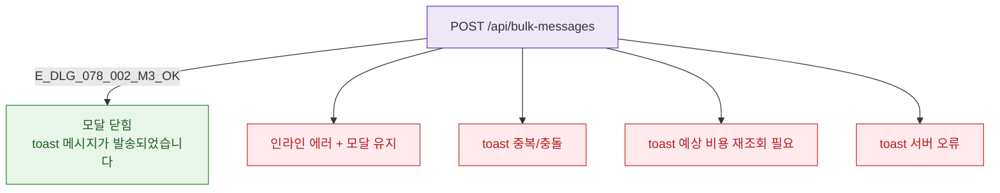

## 3. 다이어그램

```mermaid
flowchart TD
  API[POST /api/bulk-messages] -->|E_DLG_078_002_M3_OK|SUCCESS[모달 닫힘\ntoast 메시지가 발송되었습니다]
  API --> ERR_400[인라인 에러 + 모달 유지]
  API --> ERR_409[toast 중복/충돌]
  API --> ERR_412[toast 예상 비용 재조회 필요]
  API --> ERR_500[toast 서버 오류]

  classDef success fill:#E8F5E9,stroke:#2E7D32,color:#1B5E20
  classDef error fill:#FFEBEE,stroke:#C62828,color:#B71C1C
  classDef system fill:#EDE7F6,stroke:#5E35B2

  class SUCCESS success
  class ERR_400,ERR_409,ERR_412,ERR_500 error
  class API system
```
