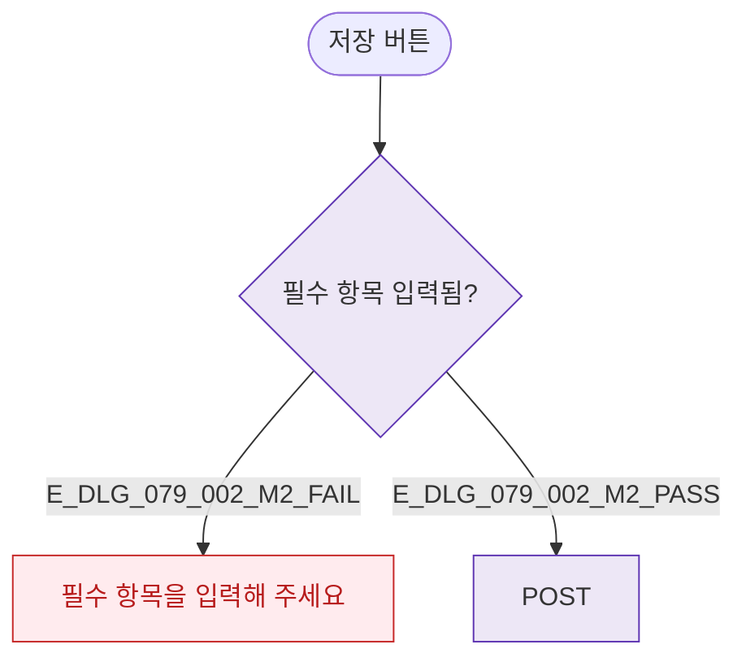

## 3. 다이어그램

```mermaid
flowchart TD
  SUBMIT([저장 버튼]) --> V_REQ{필수 항목 입력됨?}
  V_REQ -->|E_DLG_079_002_M2_FAIL|ERR[필수 항목을 입력해 주세요]
  V_REQ -->|E_DLG_079_002_M2_PASS|API[POST]

  classDef error fill:#FFEBEE,stroke:#C62828,color:#B71C1C
  classDef system fill:#EDE7F6,stroke:#5E35B2

  class ERR error
  class V_REQ,API system
```
