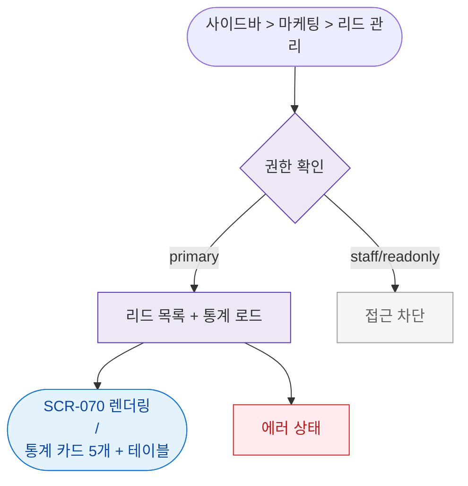

## 3. 다이어그램

```mermaid
flowchart TD
  SIDEBAR([사이드바 > 마케팅 > 리드 관리])
  SIDEBAR --> AUTH{권한 확인}

  AUTH -->|primary|LOAD[리드 목록 + 통계 로드]
  AUTH -->|staff/readonly|BLOCKED[접근 차단]

  LOAD --> SCR_070([SCR-070 렌더링\n/\n통계 카드 5개 + 테이블])
  LOAD --> ERR[에러 상태]

  classDef screen fill:#E3F2FD,stroke:#1976D2,color:#0D47A1
  classDef system fill:#EDE7F6,stroke:#5E35B2
  classDef error fill:#FFEBEE,stroke:#C62828,color:#B71C1C
  classDef rbacBlocked fill:#F5F5F5,stroke:#9E9E9E,color:#616161

  class SCR_070 screen
  class LOAD,AUTH system
  class ERR error
  class BLOCKED rbacBlocked
```
