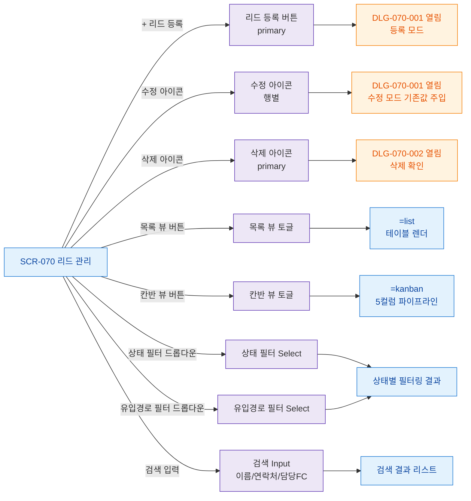

## 1. 목적

SCR-070 화면 내 모든 버튼/액션 노드를 망라하여 버튼별 동작 TC 원천을 제공한다.

## 2. 전제조건

- SCR-070 렌더링 완료 상태

## 3. 다이어그램

## 4. 엣지 설명

| 버튼 | 동작 |
|------|------|
| + 리드 등록 | DLG-070-001 등록 모드 열기 |
| 수정 아이콘 | DLG-070-001 수정 모드 (기존값) |
| 삭제 아이콘 | DLG-070-002 삭제 확인 |
| 목록 뷰 버튼 | =list |
| 칸반 뷰 버튼 | =kanban |
| 상태 필터 | 변경 |
| 유입경로 필터 | 변경 |
| 검색 입력 | 변경 |
