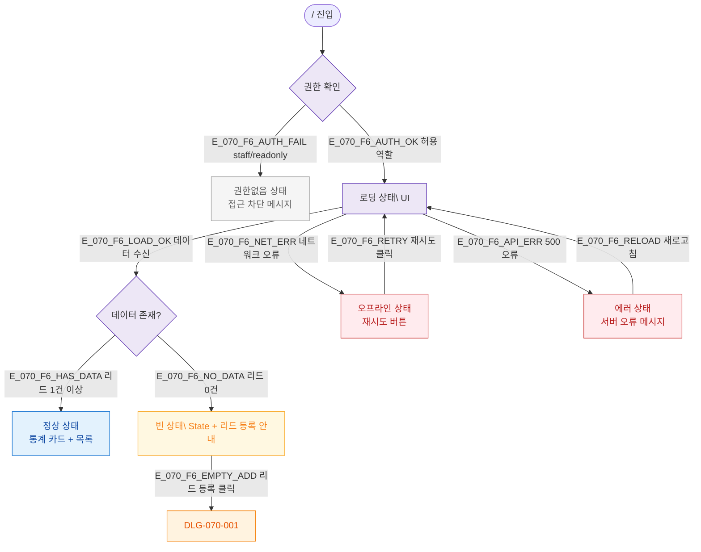

## 1. 목적

SCR-070의 로딩/빈/에러/권한없음/오프라인 상태별 UI 분기를 TC 원천으로 제공한다.

## 2. 전제조건

- `/` 경로 진입

## 3. 다이어그램

## 4. 엣지 설명

| 상태 | 조건 |
|------|------|
| 권한없음 | staff/readonly 역할 |
| 정상 로드 | API 200 |
| 오프라인 | 네트워크 오류 |
| 서버 에러 | 500 응답 |
| 정상 상태 | 리드 1건 이상 |
| 빈 상태 | 리드 0건 |
