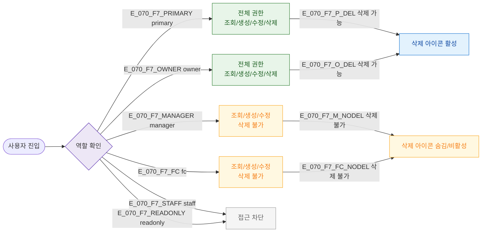

## 1. 목적

6개 역할별 SCR-070 접근 및 액션 가능 범위를 RBAC TC 원천으로 제공한다.

## 2. 전제조건

- 로그인 완료, / 진입 시도

## 3. 다이어그램

## 4. 엣지 설명

| 역할 | 권한 |
|------|------|
| primary | 조회/생성/수정/삭제 |
| owner | 조회/생성/수정/삭제 |
| manager | 조회/생성/수정 (삭제 불가) |
| fc | 조회/생성/수정 (삭제 불가) |
| staff | 접근 차단 |
| readonly | 접근 차단 |
