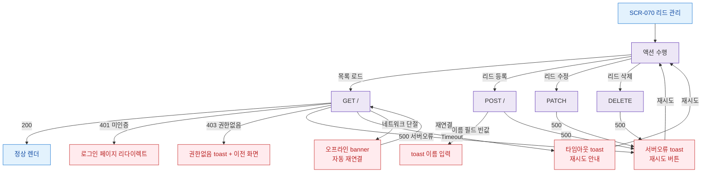

## 1. 목적

SCR-070에서 발생 가능한 에러/예외 케이스와 복구 경로를 네거티브 TC 원천으로 제공한다.

## 2. 전제조건

- SCR-070 접근 가능 역할 로그인

## 3. 다이어그램

## 4. 엣지 설명

| 에러 코드 | 처리 |
|----------|------|
| 401 미인증 | 로그인 리다이렉트 |
| 403 권한없음 | toast + 이전 화면 |
| 500 서버오류 | 에러 toast + 재시도 |
| Timeout | 타임아웃 toast + 재시도 |
| 네트워크 단절 | 오프라인 banner |
| 필드 검증 실패 | toast |
