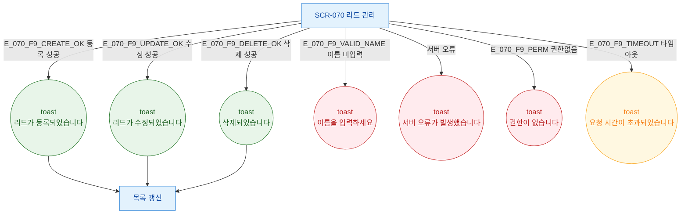

## 1. 목적

SCR-070에서 발생하는 모든 토스트(성공/경고/에러/정보) 발생 조건을 TC 피드백 원천으로 제공한다.

## 2. 전제조건

- SCR-070 정상 접근 상태

## 3. 다이어그램

## 4. 엣지 설명

| 트리거 | 토스트 유형 | 메시지 |
|--------|-----------|--------|
| 등록 성공 | success | 리드가 등록되었습니다 |
| 수정 성공 | success | 리드가 수정되었습니다 |
| 삭제 성공 | success | 삭제되었습니다 |
| 이름 미입력 | error | 이름을 입력하세요 |
| 서버 오류 | error | 서버 오류가 발생했습니다 |
| 권한없음 | error | 권한이 없습니다 |
| 타임아웃 | warning | 요청 시간이 초과되었습니다 |
