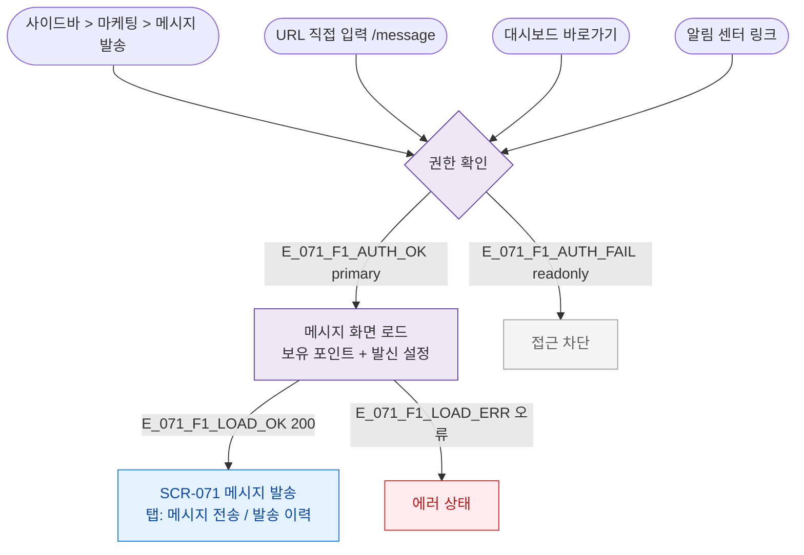

## 1. 목적

SCR-071 진입 경로(사이드바/URL직접/알림/대시보드)와 권한 분기를 TC 원천으로 제공한다.

## 2. 전제조건

- 로그인 상태

## 3. 다이어그램

## 4. 엣지 설명

| 진입 경로 | 설명 |
|----------|------|
| 사이드바 | 마케팅 > 메시지 발송 |
| URL 직접 | /message |
| 대시보드 | 바로가기 위젯 |
| 인증 통과 | primary~staff |
| 인증 실패 | readonly |
