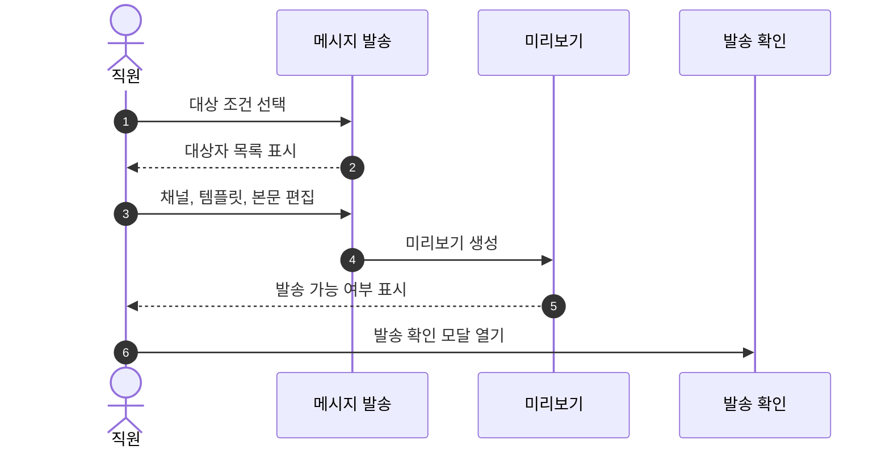

# SCR-071 메시지 발송 메인 인터랙션

```mermaid
sequenceDiagram
    autonumber
    actor Staff as 직원
    participant Screen as 메시지 발송
    participant Preview as 미리보기
    participant Confirm as 발송 확인

    Staff->>Screen: 대상 조건 선택
    Screen-->>Staff: 대상자 목록 표시
    Staff->>Screen: 채널, 템플릿, 본문 편집
    Screen->>Preview: 미리보기 생성
    Preview-->>Staff: 발송 가능 여부 표시
    Staff->>Confirm: 발송 확인 모달 열기
```
