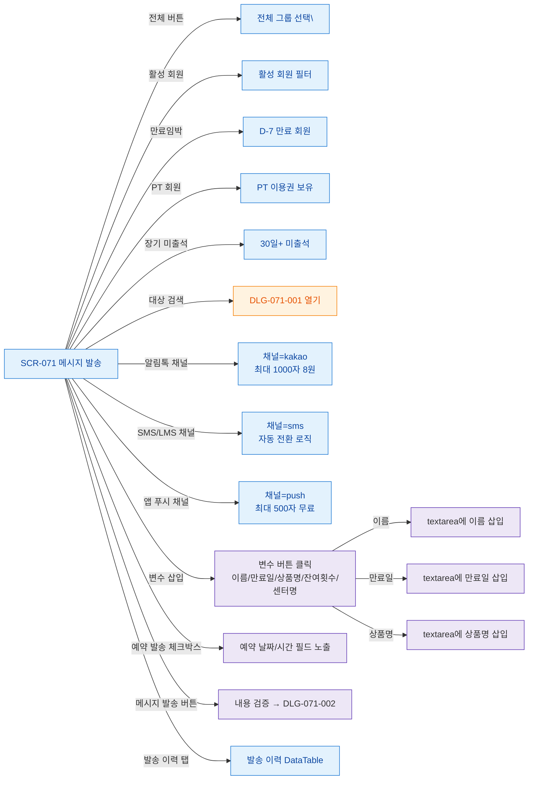

## 1. 목적

SCR-071 내 모든 버튼/액션 노드를 망라하여 버튼별 동작 TC 원천을 제공한다.

## 2. 전제조건

- SCR-071 렌더링 완료

## 3. 다이어그램

## 4. 엣지 설명

| 버튼 | 동작 |
|------|------|
| 전체 버튼 | |
| 대상 검색 | DLG-071-001 열기 |
| 변수 삽입 | textarea 커서 위치에 변수 삽입 |
| 예약 발송 체크 | 날짜/시간 필드 노출 |
| 발송 버튼 | 검증 → DLG-071-002 |
| 발송 이력 탭 | 이력 DataTable 로드 |
