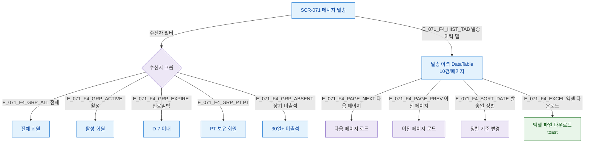

## 1. 목적

수신자 필터링, 발송 이력 검색·정렬·페이지네이션 흐름을 TC 원천으로 제공한다.

## 2. 전제조건

- SCR-071 렌더링 완료

## 3. 다이어그램

## 4. 엣지 설명

| 필터/액션 | 결과 |
|----------|------|
| 전체 버튼 | 전체 회원 수신자 |
| 이력 탭 | DataTable 10건/페이지 |
| 엑셀 | 파일 다운로드 + toast |
