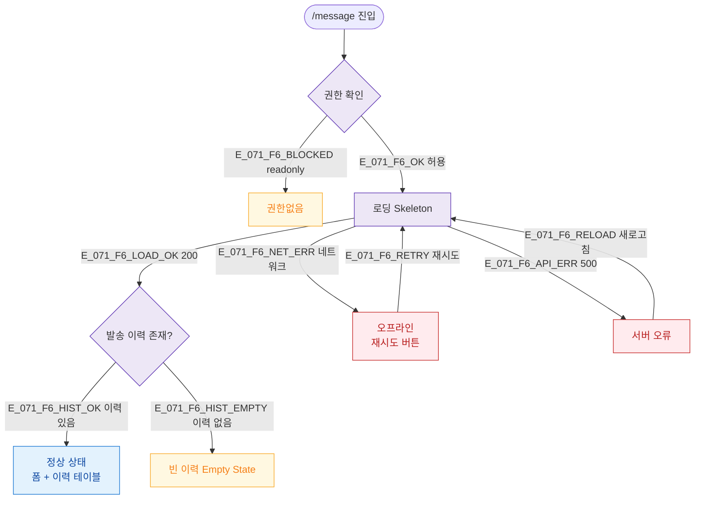

## 1. 목적

SCR-071의 로딩/빈/에러/권한없음/오프라인 상태 분기를 UI 상태 TC 원천으로 제공한다.

## 2. 전제조건

- /message 경로 진입

## 3. 다이어그램

```mermaid
flowchart TD
  ENTER([/message 진입]) --> AUTH{권한 확인}
  AUTH -->|E_071_F6_BLOCKED readonly|STATE_BLOCKED[권한없음]
  AUTH -->|E_071_F6_OK 허용|LOADING[로딩 Skeleton]

  LOADING -->|E_071_F6_LOAD_OK 200|FORM_CHECK{발송 이력 존재?}
  LOADING -->|E_071_F6_NET_ERR 네트워크|STATE_OFFLINE[오프라인\n재시도 버튼]
  LOADING -->|E_071_F6_API_ERR 500|STATE_ERROR[서버 오류]

  FORM_CHECK -->|E_071_F6_HIST_OK 이력 있음|STATE_NORMAL[정상 상태\n폼 + 이력 테이블]
  FORM_CHECK -->|E_071_F6_HIST_EMPTY 이력 없음|STATE_EMPTY_HIST[빈 이력 Empty State]

  STATE_OFFLINE -->|E_071_F6_RETRY 재시도|LOADING
  STATE_ERROR -->|E_071_F6_RELOAD 새로고침|LOADING

  classDef screen fill:#E3F2FD,stroke:#1976D2,color:#0D47A1
  classDef error fill:#FFEBEE,stroke:#C62828,color:#B71C1C
  classDef warning fill:#FFF8E1,stroke:#F9A825,color:#F57F17
  classDef system fill:#EDE7F6,stroke:#5E35B2
  classDef rbacBlocked fill:#F5F5F5,stroke:#9E9E9E,color:#616161

  class STATE_NORMAL screen
  class STATE_ERROR,STATE_OFFLINE error
  class STATE_EMPTY_HIST,STATE_BLOCKED warning
  class LOADING,FORM_CHECK,AUTH system
```
