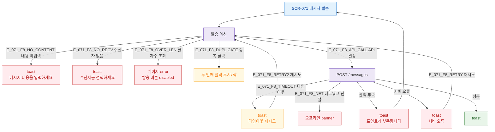

## 1. 목적

메시지 발송 시 발생 가능한 에러·예외와 복구 경로를 네거티브 TC 원천으로 제공한다.

## 2. 전제조건

- SCR-071 접근 가능 상태

## 3. 다이어그램

```mermaid
flowchart TD
  SCR_071[SCR-071 메시지 발송] --> ACT[발송 액션]

  ACT -->|E_071_F8_NO_CONTENT 내용 미입력|ERR_CONTENT[toast\n메시지 내용을 입력하세요]
  ACT -->|E_071_F8_NO_RECV 수신자 없음|ERR_RECV[toast\n수신자를 선택하세요]
  ACT -->|E_071_F8_OVER_LEN 글자수 초과|ERR_LEN[게이지 error\n발송 버튼 disabled]
  ACT -->|E_071_F8_DUPLICATE 중복 클릭|ERR_DUP[두 번째 클릭 무시\ 락]

  ACT -->|E_071_F8_API_CALL API 발송|API[POST /messages]
  API -->|성공|SUCCESS[toast]
  API -->|잔액 부족|ERR_BALANCE[toast\n포인트가 부족합니다]
  API -->|서버 오류|ERR_SERVER[toast\n서버 오류]
  API -->|E_071_F8_TIMEOUT 타임아웃|ERR_TIMEOUT[toast\n타임아웃 재시도]
  API -->|E_071_F8_NET 네트워크 단절|ERR_NET[오프라인 banner]

  ERR_BALANCE --> SCR_071
  ERR_SERVER -->|E_071_F8_RETRY 재시도|ACT
  ERR_TIMEOUT -->|E_071_F8_RETRY2 재시도|ACT

  classDef screen fill:#E3F2FD,stroke:#1976D2,color:#0D47A1
  classDef error fill:#FFEBEE,stroke:#C62828,color:#B71C1C
  classDef success fill:#E8F5E9,stroke:#2E7D32,color:#1B5E20
  classDef warning fill:#FFF8E1,stroke:#F9A825,color:#F57F17
  classDef system fill:#EDE7F6,stroke:#5E35B2

  class SCR_071 screen
  class ERR_CONTENT,ERR_RECV,ERR_LEN,ERR_BALANCE,ERR_SERVER,ERR_NET error
  class SUCCESS success
  class ERR_DUP,ERR_TIMEOUT warning
  class API,ACT system
```
