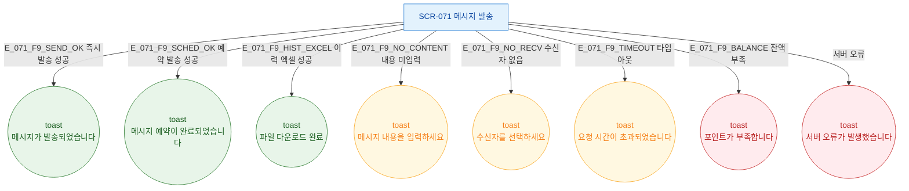

## 1. 목적

SCR-071에서 발생하는 모든 토스트/피드백 발생 조건을 TC 원천으로 제공한다.

## 2. 전제조건

- SCR-071 정상 접근 상태

## 3. 다이어그램

```mermaid
flowchart TD
  SCR_071[SCR-071 메시지 발송]

  SCR_071 -->|E_071_F9_SEND_OK 즉시 발송 성공|T_S1((toast\n메시지가 발송되었습니다))
  SCR_071 -->|E_071_F9_SCHED_OK 예약 발송 성공|T_S2((toast\n메시지 예약이 완료되었습니다))
  SCR_071 -->|E_071_F9_HIST_EXCEL 이력 엑셀 성공|T_S3((toast\n파일 다운로드 완료))

  SCR_071 -->|E_071_F9_NO_CONTENT 내용 미입력|T_W1((toast\n메시지 내용을 입력하세요))
  SCR_071 -->|E_071_F9_NO_RECV 수신자 없음|T_W2((toast\n수신자를 선택하세요))
  SCR_071 -->|E_071_F9_TIMEOUT 타임아웃|T_W3((toast\n요청 시간이 초과되었습니다))

  SCR_071 -->|E_071_F9_BALANCE 잔액 부족|T_E1((toast\n포인트가 부족합니다))
  SCR_071 -->|서버 오류|T_E2((toast\n서버 오류가 발생했습니다))

  classDef success fill:#E8F5E9,stroke:#2E7D32,color:#1B5E20
  classDef warning fill:#FFF8E1,stroke:#F9A825,color:#F57F17
  classDef error fill:#FFEBEE,stroke:#C62828,color:#B71C1C
  classDef screen fill:#E3F2FD,stroke:#1976D2,color:#0D47A1

  class T_S1,T_S2,T_S3 success
  class T_W1,T_W2,T_W3 warning
  class T_E1,T_E2 error
  class SCR_071 screen
```
