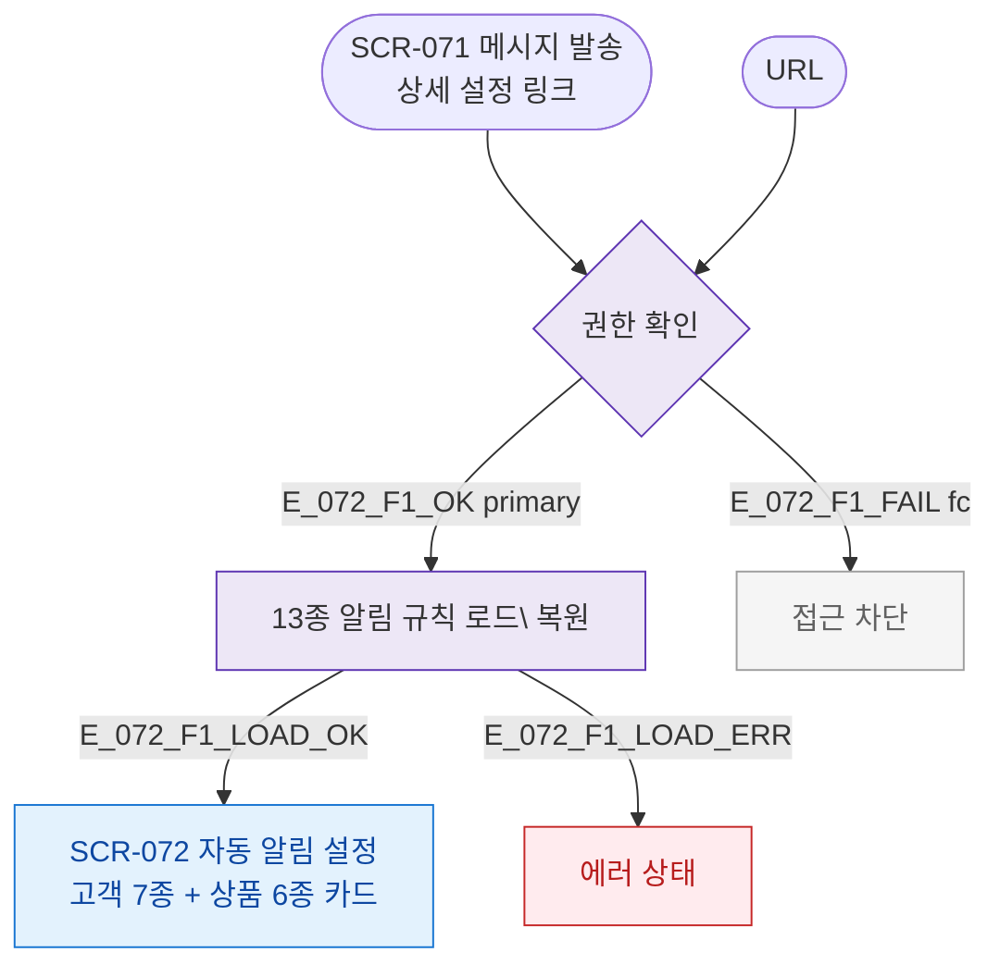

## 1. 목적

SCR-072 진입 경로와 권한 분기를 TC 원천으로 제공한다.

## 2. 전제조건

- 로그인 상태

## 3. 다이어그램

```mermaid
flowchart TD
  MSG([SCR-071 메시지 발송\n상세 설정 링크]) --> AUTH
  URL([URL]) --> AUTH

  AUTH{권한 확인} -->|E_072_F1_OK primary|LOAD[13종 알림 규칙 로드\ 복원]
  AUTH -->|E_072_F1_FAIL fc|BLOCKED[접근 차단]

  LOAD -->|E_072_F1_LOAD_OK|SCR_072[SCR-072 자동 알림 설정\n고객 7종 + 상품 6종 카드]
  LOAD -->|E_072_F1_LOAD_ERR|ERR[에러 상태]

  classDef screen fill:#E3F2FD,stroke:#1976D2,color:#0D47A1
  classDef error fill:#FFEBEE,stroke:#C62828,color:#B71C1C
  classDef system fill:#EDE7F6,stroke:#5E35B2
  classDef rbacBlocked fill:#F5F5F5,stroke:#9E9E9E,color:#616161

  class SCR_072 screen
  class ERR error
  class AUTH,LOAD system
  class BLOCKED rbacBlocked
```
