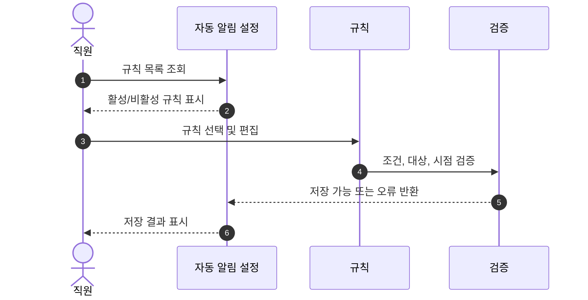

# SCR-072 자동 알림 설정 메인 인터랙션

```mermaid
sequenceDiagram
    autonumber
    actor Staff as 직원
    participant Screen as 자동 알림 설정
    participant Rule as 규칙
    participant Validator as 검증

    Staff->>Screen: 규칙 목록 조회
    Screen-->>Staff: 활성/비활성 규칙 표시
    Staff->>Rule: 규칙 선택 및 편집
    Rule->>Validator: 조건, 대상, 시점 검증
    Validator-->>Screen: 저장 가능 또는 오류 반환
    Screen-->>Staff: 저장 결과 표시
```
