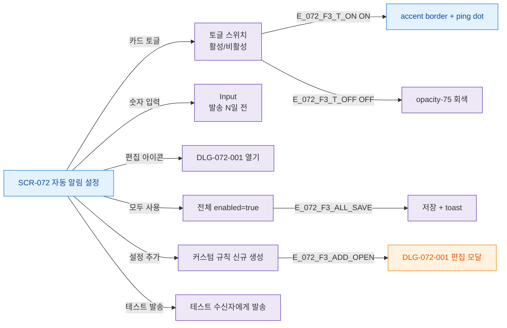

## 3. 다이어그램

```mermaid
flowchart LR
  SCR_072[SCR-072 자동 알림 설정]

  SCR_072 -->|카드 토글|BTN_TOGGLE[토글 스위치\n활성/비활성]
  SCR_072 -->|숫자 입력|BTN_NUM[Input\n발송 N일 전]
  SCR_072 -->|편집 아이콘|BTN_EDIT[DLG-072-001 열기]
  SCR_072 -->|모두 사용|BTN_ALL[전체 enabled=true]
  SCR_072 -->|설정 추가|BTN_ADD[커스텀 규칙 신규 생성]
  SCR_072 -->|테스트 발송|BTN_TEST[테스트 수신자에게 발송]

  BTN_TOGGLE -->|E_072_F3_T_ON ON|STYLE_ACTIVE[accent border + ping dot]
  BTN_TOGGLE -->|E_072_F3_T_OFF OFF|STYLE_INACTIVE[opacity-75 회색]
  BTN_ALL -->|E_072_F3_ALL_SAVE|SAVE[저장 + toast]
  BTN_ADD -->|E_072_F3_ADD_OPEN|DLG_001[DLG-072-001 편집 모달]

  classDef screen fill:#E3F2FD,stroke:#1976D2,color:#0D47A1
  classDef modal fill:#FFF3E0,stroke:#F57C00,color:#E65100
  classDef system fill:#EDE7F6,stroke:#5E35B2

  class SCR_072,STYLE_ACTIVE screen
  class DLG_001 modal
  class BTN_TOGGLE,BTN_NUM,BTN_EDIT,BTN_ALL,BTN_ADD,BTN_TEST,STYLE_INACTIVE,SAVE system
```
