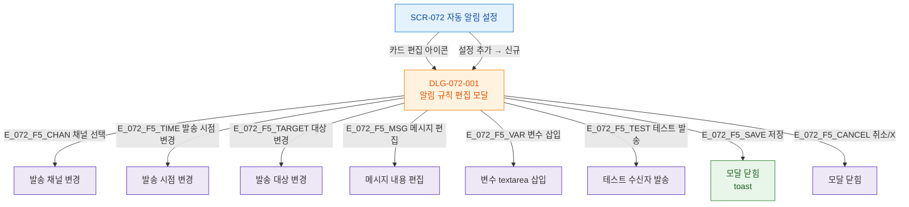

## 3. 다이어그램

```mermaid
flowchart TD
  SCR_072[SCR-072 자동 알림 설정]

  SCR_072 -->|카드 편집 아이콘|DLG_001[DLG-072-001\n알림 규칙 편집 모달]
  SCR_072 -->|설정 추가 → 신규|DLG_001

  DLG_001 -->|E_072_F5_CHAN 채널 선택|CHAN[발송 채널 변경]
  DLG_001 -->|E_072_F5_TIME 발송 시점 변경|TIMING[발송 시점 변경]
  DLG_001 -->|E_072_F5_TARGET 대상 변경|TARGET[발송 대상 변경]
  DLG_001 -->|E_072_F5_MSG 메시지 편집|MSG[메시지 내용 편집]
  DLG_001 -->|E_072_F5_VAR 변수 삽입|VAR[변수 textarea 삽입]
  DLG_001 -->|E_072_F5_TEST 테스트 발송|TEST[테스트 수신자 발송]
  DLG_001 -->|E_072_F5_SAVE 저장|SAVED[모달 닫힘\ntoast]
  DLG_001 -->|E_072_F5_CANCEL 취소/X|CANCEL[모달 닫힘]

  classDef screen fill:#E3F2FD,stroke:#1976D2,color:#0D47A1
  classDef modal fill:#FFF3E0,stroke:#F57C00,color:#E65100
  classDef success fill:#E8F5E9,stroke:#2E7D32,color:#1B5E20
  classDef system fill:#EDE7F6,stroke:#5E35B2

  class SCR_072 screen
  class DLG_001 modal
  class SAVED success
  class CHAN,TIMING,TARGET,MSG,VAR,TEST,CANCEL system
```
