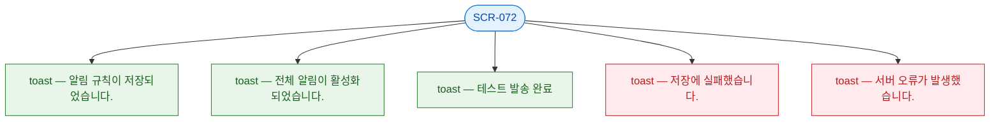

## 3. 다이어그램

## 4. 토스트 목록

| 트리거 | 유형 | 메시지 |
|--------|------|--------|
| 규칙 저장 성공 | success | 알림 규칙이 저장되었습니다. |
| 전체 활성화 | success | 전체 알림이 활성화되었습니다. |
| 테스트 발송 성공 | success | 테스트 발송 완료 |
| 저장 실패 | error | 저장에 실패했습니다. |
| 서버 오류 | error | 서버 오류가 발생했습니다. |
