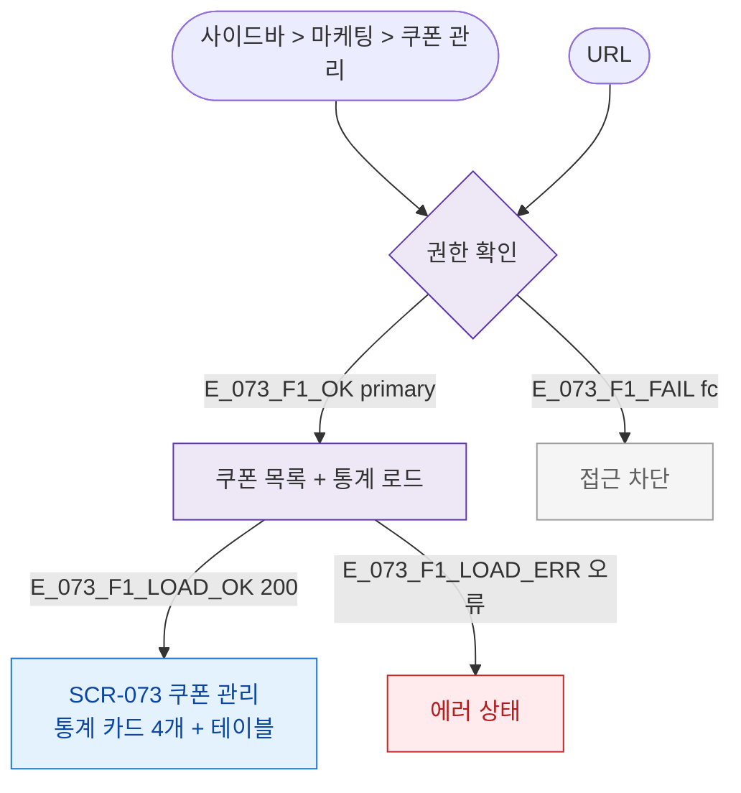

## 1. 목적

SCR-073 진입 경로와 권한 분기를 TC 원천으로 제공한다.

## 2. 전제조건

- 로그인 상태

## 3. 다이어그램

```mermaid
flowchart TD
  SIDEBAR([사이드바 > 마케팅 > 쿠폰 관리]) --> AUTH
  URL([URL]) --> AUTH

  AUTH{권한 확인} -->|E_073_F1_OK primary|LOAD[쿠폰 목록 + 통계 로드]
  AUTH -->|E_073_F1_FAIL fc|BLOCKED[접근 차단]

  LOAD -->|E_073_F1_LOAD_OK 200|SCR_073[SCR-073 쿠폰 관리\n통계 카드 4개 + 테이블]
  LOAD -->|E_073_F1_LOAD_ERR 오류|ERR[에러 상태]

  classDef screen fill:#E3F2FD,stroke:#1976D2,color:#0D47A1
  classDef error fill:#FFEBEE,stroke:#C62828,color:#B71C1C
  classDef system fill:#EDE7F6,stroke:#5E35B2
  classDef rbacBlocked fill:#F5F5F5,stroke:#9E9E9E,color:#616161

  class SCR_073 screen
  class ERR error
  class AUTH,LOAD system
  class BLOCKED rbacBlocked
```
