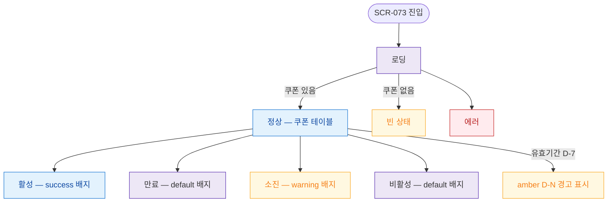

## 3. 다이어그램

```mermaid
flowchart TD
  ENTER([SCR-073 진입])
  ENTER --> STATE_LOADING[로딩]
  STATE_LOADING -->|쿠폰 있음|STATE_NORMAL[정상 — 쿠폰 테이블]
  STATE_LOADING -->|쿠폰 없음|STATE_EMPTY[빈 상태]
  STATE_LOADING --> STATE_ERR[에러]

  STATE_NORMAL --> BADGE_ACTIVE[활성 — success 배지]
  STATE_NORMAL --> BADGE_EXPIRED[만료 — default 배지]
  STATE_NORMAL --> BADGE_EXHAUSTED[소진 — warning 배지]
  STATE_NORMAL --> BADGE_INACTIVE[비활성 — default 배지]
  STATE_NORMAL -->|유효기간 D-7|D7_WARN[amber D-N 경고 표시]

  classDef screen fill:#E3F2FD,stroke:#1976D2,color:#0D47A1
  classDef system fill:#EDE7F6,stroke:#5E35B2
  classDef error fill:#FFEBEE,stroke:#C62828,color:#B71C1C
  classDef warning fill:#FFF8E1,stroke:#F9A825,color:#F57F17
  classDef success fill:#E8F5E9,stroke:#2E7D32,color:#1B5E20

  class STATE_NORMAL,BADGE_ACTIVE screen
  class STATE_LOADING system
  class STATE_ERR error
  class STATE_EMPTY,BADGE_EXHAUSTED,D7_WARN warning
  class BADGE_EXPIRED,BADGE_INACTIVE system
```
