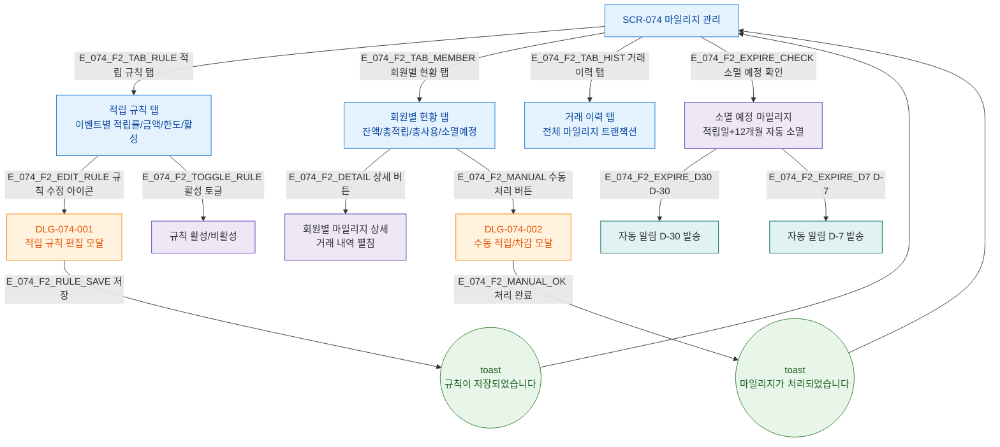

## 3. 다이어그램

```mermaid
flowchart TD
  SCR_074[SCR-074 마일리지 관리]

  SCR_074 -->|E_074_F2_TAB_RULE 적립 규칙 탭|TAB_RULE[적립 규칙 탭\n이벤트별 적립률/금액/한도/활성]
  SCR_074 -->|E_074_F2_TAB_MEMBER 회원별 현황 탭|TAB_MEMBER[회원별 현황 탭\n잔액/총적립/총사용/소멸예정]
  SCR_074 -->|E_074_F2_TAB_HIST 거래 이력 탭|TAB_HIST[거래 이력 탭\n전체 마일리지 트랜잭션]

  TAB_RULE -->|E_074_F2_EDIT_RULE 규칙 수정 아이콘|DLG_001[DLG-074-001\n적립 규칙 편집 모달]
  TAB_RULE -->|E_074_F2_TOGGLE_RULE 활성 토글|RULE_TOGGLE[규칙 활성/비활성]

  TAB_MEMBER -->|E_074_F2_DETAIL 상세 버튼|MEMBER_DETAIL[회원별 마일리지 상세\n거래 내역 펼침]
  TAB_MEMBER -->|E_074_F2_MANUAL 수동 처리 버튼|DLG_002[DLG-074-002\n수동 적립/차감 모달]

  DLG_001 -->|E_074_F2_RULE_SAVE 저장|T_RULE_OK((toast\n규칙이 저장되었습니다))
  DLG_002 -->|E_074_F2_MANUAL_OK 처리 완료|T_MANUAL_OK((toast\n마일리지가 처리되었습니다))
  T_RULE_OK --> SCR_074
  T_MANUAL_OK --> SCR_074

  %% 소멸 규칙 자동화
  SCR_074 -->|E_074_F2_EXPIRE_CHECK 소멸 예정 확인|EXPIRE[소멸 예정 마일리지\n적립일+12개월 자동 소멸]
  EXPIRE -->|E_074_F2_EXPIRE_D30 D-30|AUTO_NOTIF_30[자동 알림 D-30 발송]
  EXPIRE -->|E_074_F2_EXPIRE_D7 D-7|AUTO_NOTIF_7[자동 알림 D-7 발송]

  classDef screen fill:#E3F2FD,stroke:#1976D2,color:#0D47A1
  classDef modal fill:#FFF3E0,stroke:#F57C00,color:#E65100
  classDef success fill:#E8F5E9,stroke:#2E7D32,color:#1B5E20
  classDef system fill:#EDE7F6,stroke:#5E35B2
  classDef cron fill:#E0F2F1,stroke:#00695C

  class SCR_074,TAB_RULE,TAB_MEMBER,TAB_HIST screen
  class DLG_001,DLG_002 modal
  class T_RULE_OK,T_MANUAL_OK success
  class EXPIRE,RULE_TOGGLE,MEMBER_DETAIL system
  class AUTO_NOTIF_30,AUTO_NOTIF_7 cron
```
