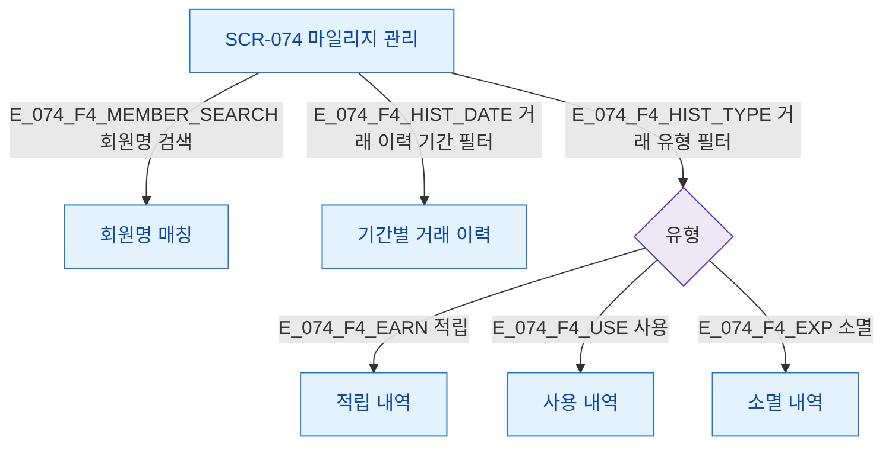

## 3. 다이어그램

```mermaid
flowchart TD
  SCR_074[SCR-074 마일리지 관리]

  SCR_074 -->|E_074_F4_MEMBER_SEARCH 회원명 검색|SEARCH_M[회원명 매칭]
  SCR_074 -->|E_074_F4_HIST_DATE 거래 이력 기간 필터|HIST_DATE[기간별 거래 이력]
  SCR_074 -->|E_074_F4_HIST_TYPE 거래 유형 필터|HIST_TYPE{유형}
  HIST_TYPE -->|E_074_F4_EARN 적립|R_EARN[적립 내역]
  HIST_TYPE -->|E_074_F4_USE 사용|R_USE[사용 내역]
  HIST_TYPE -->|E_074_F4_EXP 소멸|R_EXP[소멸 내역]

  classDef screen fill:#E3F2FD,stroke:#1976D2,color:#0D47A1
  classDef system fill:#EDE7F6,stroke:#5E35B2

  class SCR_074,SEARCH_M,HIST_DATE,R_EARN,R_USE,R_EXP screen
  class HIST_TYPE system
```
