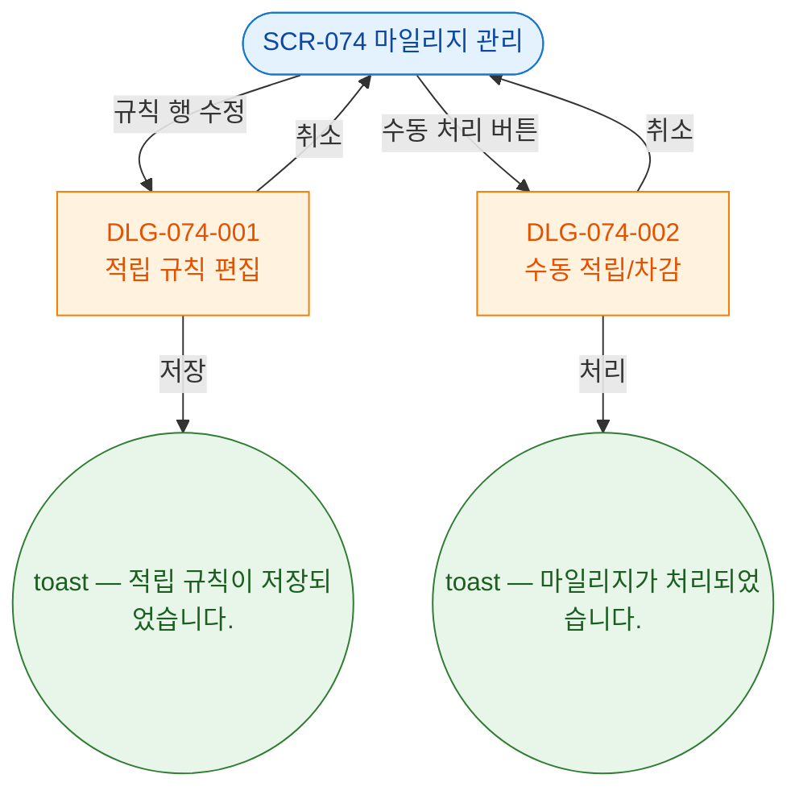

## 3. 다이어그램

```mermaid
flowchart TD
  SCR_074([SCR-074 마일리지 관리])

  SCR_074 -->|규칙 행 수정|DLG_001[DLG-074-001\n적립 규칙 편집]
  SCR_074 -->|수동 처리 버튼|DLG_002[DLG-074-002\n수동 적립/차감]

  DLG_001 -->|취소|SCR_074
  DLG_001 -->|저장|TOAST_RULE_OK((toast — 적립 규칙이 저장되었습니다.))

  DLG_002 -->|취소|SCR_074
  DLG_002 -->|처리|TOAST_MANUAL_OK((toast — 마일리지가 처리되었습니다.))

  classDef screen fill:#E3F2FD,stroke:#1976D2,color:#0D47A1
  classDef modal fill:#FFF3E0,stroke:#F57C00,color:#E65100
  classDef success fill:#E8F5E9,stroke:#2E7D32,color:#1B5E20

  class SCR_074 screen
  class DLG_001,DLG_002 modal
  class TOAST_RULE_OK,TOAST_MANUAL_OK success
```
