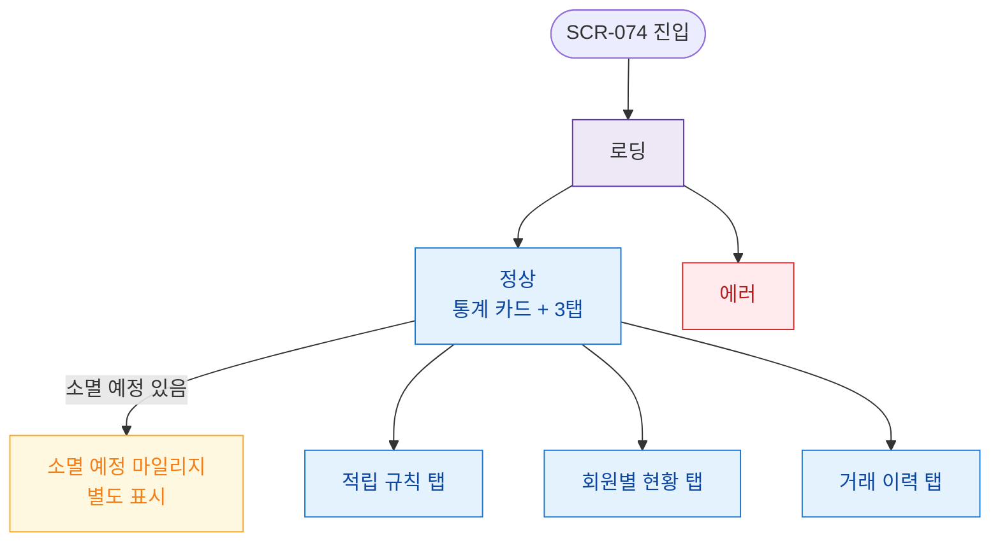

## 3. 다이어그램

```mermaid
flowchart TD
  ENTER([SCR-074 진입])
  ENTER --> STATE_LOADING[로딩]
  STATE_LOADING --> STATE_NORMAL[정상\n통계 카드 + 3탭]
  STATE_LOADING --> STATE_ERR[에러]

  STATE_NORMAL -->|소멸 예정 있음|EXPIRE_WARN[소멸 예정 마일리지\n별도 표시]
  STATE_NORMAL --> TAB_RULE[적립 규칙 탭]
  STATE_NORMAL --> TAB_MEMBER[회원별 현황 탭]
  STATE_NORMAL --> TAB_HIST[거래 이력 탭]

  classDef screen fill:#E3F2FD,stroke:#1976D2,color:#0D47A1
  classDef system fill:#EDE7F6,stroke:#5E35B2
  classDef error fill:#FFEBEE,stroke:#C62828,color:#B71C1C
  classDef warning fill:#FFF8E1,stroke:#F9A825,color:#F57F17

  class STATE_NORMAL,TAB_RULE,TAB_MEMBER,TAB_HIST screen
  class STATE_LOADING system
  class STATE_ERR error
  class EXPIRE_WARN warning
```
