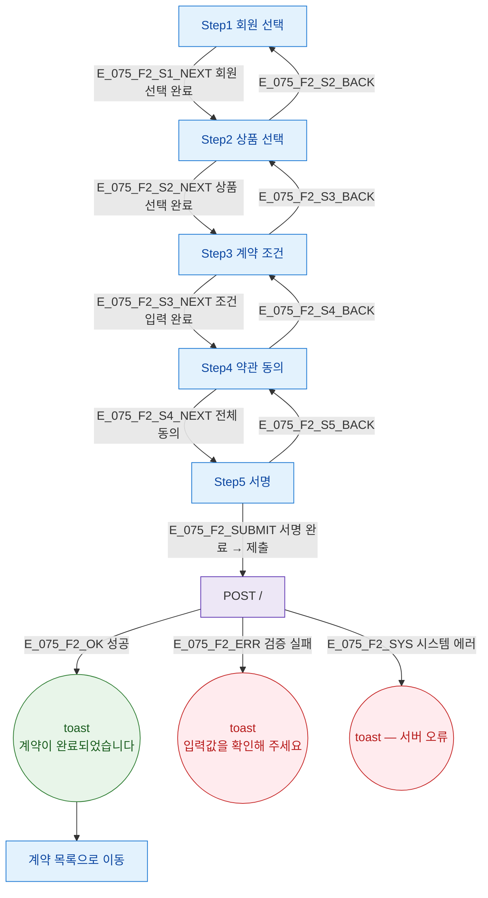

## 1. 목적

5단계 위자드(회원선택→상품선택→계약조건→약관동의→서명) Happy Path를 TC 원천으로 제공한다.

## 2. 전제조건

- SCR-075 Step1 렌더링 완료, RBAC 허용 상태

## 3. 다이어그램

```mermaid
flowchart TD
  S1[Step1 회원 선택] -->|E_075_F2_S1_NEXT 회원 선택 완료|S2[Step2 상품 선택]
  S2 -->|E_075_F2_S2_NEXT 상품 선택 완료|S3[Step3 계약 조건]
  S3 -->|E_075_F2_S3_NEXT 조건 입력 완료|S4[Step4 약관 동의]
  S4 -->|E_075_F2_S4_NEXT 전체 동의|S5[Step5 서명]

  S5 -->|E_075_F2_SUBMIT 서명 완료 → 제출|API[POST /]

  API -->|E_075_F2_OK 성공|T_OK((toast\n계약이 완료되었습니다))
  API -->|E_075_F2_ERR 검증 실패|T_ERR((toast\n입력값을 확인해 주세요))
  API -->|E_075_F2_SYS 시스템 에러|T_SYS((toast — 서버 오류))

  T_OK --> DONE[계약 목록으로 이동]

  S2 -->|E_075_F2_S2_BACK|S1
  S3 -->|E_075_F2_S3_BACK|S2
  S4 -->|E_075_F2_S4_BACK|S3
  S5 -->|E_075_F2_S5_BACK|S4

  classDef screen fill:#E3F2FD,stroke:#1976D2,color:#0D47A1
  classDef success fill:#E8F5E9,stroke:#2E7D32,color:#1B5E20
  classDef error fill:#FFEBEE,stroke:#C62828,color:#B71C1C
  classDef system fill:#EDE7F6,stroke:#5E35B2

  class S1,S2,S3,S4,S5,DONE screen
  class T_OK success
  class T_ERR,T_SYS error
  class API system
```
