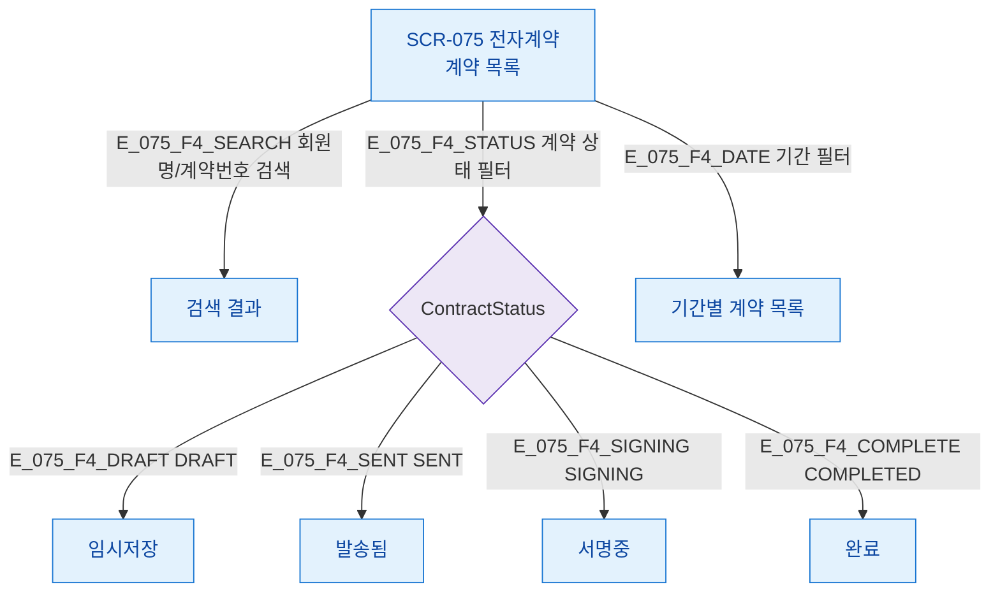

## 3. 다이어그램

```mermaid
flowchart TD
  SCR_075[SCR-075 전자계약\n계약 목록]

  SCR_075 -->|E_075_F4_SEARCH 회원명/계약번호 검색|SEARCH[검색 결과]
  SCR_075 -->|E_075_F4_STATUS 계약 상태 필터|STATUS_F{ContractStatus}
  STATUS_F -->|E_075_F4_DRAFT DRAFT|R_DRAFT[임시저장]
  STATUS_F -->|E_075_F4_SENT SENT|R_SENT[발송됨]
  STATUS_F -->|E_075_F4_SIGNING SIGNING|R_SIGNING[서명중]
  STATUS_F -->|E_075_F4_COMPLETE COMPLETED|R_COMPLETE[완료]
  SCR_075 -->|E_075_F4_DATE 기간 필터|DATE_F[기간별 계약 목록]

  classDef screen fill:#E3F2FD,stroke:#1976D2,color:#0D47A1
  classDef system fill:#EDE7F6,stroke:#5E35B2

  class SCR_075,SEARCH,R_DRAFT,R_SENT,R_SIGNING,R_COMPLETE,DATE_F screen
  class STATUS_F system
```
