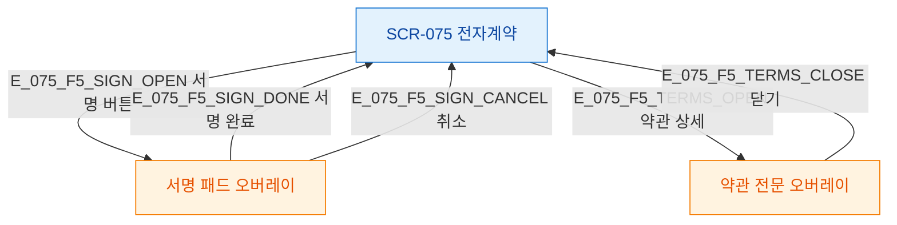

## 1. 목적

전자계약 위자드는 별도 DLG 모달 없이 인라인 위자드로 구성된다. 서명 패드와 약관 상세보기만 오버레이로 처리한다.

## 3. 다이어그램

```mermaid
flowchart TD
  SCR_075[SCR-075 전자계약]

  SCR_075 -->|E_075_F5_SIGN_OPEN 서명 버튼|SIGN_PAD[서명 패드 오버레이]
  SCR_075 -->|E_075_F5_TERMS_OPEN 약관 상세|TERMS_VIEW[약관 전문 오버레이]

  SIGN_PAD -->|E_075_F5_SIGN_DONE 서명 완료|SCR_075
  SIGN_PAD -->|E_075_F5_SIGN_CANCEL 취소|SCR_075
  TERMS_VIEW -->|E_075_F5_TERMS_CLOSE 닫기|SCR_075

  classDef screen fill:#E3F2FD,stroke:#1976D2,color:#0D47A1
  classDef modal fill:#FFF3E0,stroke:#F57C00,color:#E65100
  classDef system fill:#EDE7F6,stroke:#5E35B2

  class SCR_075 screen
  class SIGN_PAD,TERMS_VIEW modal
```
